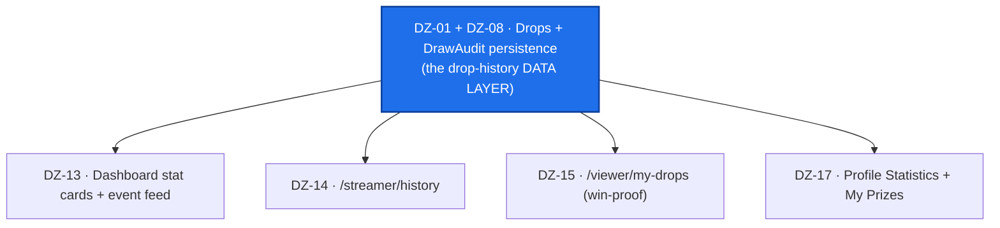
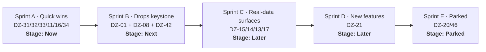

# DROPZONA — Placeholder-Fill Roadmap

> **The developer board for two frontend/full-stack devs.** Dropzona is CS2 skin-giveaway automation for Twitch: a viewer joins a free giveaway in chat, a Steam GSI event (an ace, a clutch) triggers a draw, and the winner is delivered a real skin. This board's only job: **fix the broken UI and fill the "Coming soon" placeholders across 8 routes with real logic.**

**Scope of this repo:** the developer-facing gap/placeholder work only. No money path, no GTM, no pricing, no core-infra — those are tracked separately by the CEO and are **out of scope here.**
**Grounded in:** the code-verified placeholder audit against prod `HEAD 61d0e5a` (branch `prod`).
**Companion doc:** [`docs/roadmap/frontend-placeholders.md`](docs/roadmap/frontend-placeholders.md) — the full per-surface detail behind every ticket below.

---

## 🔑 Read first — the keystone orders everything

Today `GiveawayOrchestrator.StartGiveaway` draws a winner, buys + delivers the skin, and **persists nothing** — the result is only *logged*. There is **no `Drops` table, no `DrawAudit` table, no entity, no migration.** That single missing write-path is the root cause behind **most** of the placeholders: the dashboard stat cards + feed, history, profile Statistics/Prizes, and viewer my-drops all have **no data to show.**

So this is **not** "so many gaps." It's **one data-layer keystone**, a handful of **free quick wins**, one **net-new feature**, and a **discovery graph you shouldn't build yet.**

**The move:** ship the quick wins **now** (they need no Drops), land the Drops data layer **next**, then light up the real-data surfaces the day it lands — cheap wiring over markup that already exists commented behind `<ComingSoon/>`.

---

## Legend

| Field | Values |
|---|---|
| **Stage** (board column) | **Now** · **Next** · **Later** · **Parked** · **Done** |
| **Sprint** | `A` Quick wins · `B` Drops keystone · `C` Real-data surfaces · `D` New features · `E` Parked |
| **Priority** | 🔴 `P0` unblocks the keystone / most surfaces · 🟠 `P1` trust or feature · 🟡 `P2` polish / debt |
| **Effort** | `S` ≤ ½ day · `M` ≤ 2 days · `L` ≤ 1 week |
| **Area** | Frontend · Backend · Frontend+Backend |
| **Type** | Bug · Feature · Chore · Epic |

**GitHub labels (slash-delimited):** `priority/P0`…`priority/P2` · `effort/S`…`effort/L` · `area/frontend`, `area/backend` · `type/{bug,feature,chore,epic}` · `status/{now,next,later,parked,done}`.
**Board Stage single-select:** `Now` / `Next` / `Later` / `Parked` / `Done`.
**Milestones (5, one per sprint):** `Sprint A · Quick wins` · `Sprint B · Drops keystone` · `Sprint C · Real-data surfaces` · `Sprint D · New features` · `Sprint E · Parked`.
**Ticket IDs** are stable `DZ-xx` across every doc.

---

# 📋 Board view

*One table per Stage column. 16 tickets total.*

### 🟢 Now — active sprint (Sprint A · Quick wins)

| ID | Item | Sprint | Priority | Effort | Area | One-line |
|---|---|:--:|:--:|:--:|---|---|
| `DZ-31` | Dashboard: wire the Triggers-summary panel | A | 🟠 P1 | S | Frontend | Re-map the commented markup to the live `GameTrigger` shape, reusing the giveaway-settings rules — **no backend.** |
| `DZ-32` | New `GET /streamer/health` + wire the page | A | 🟠 P1 | M | Frontend+Backend | Aggregate session presence + is-live + GSI last-seen; ship the 3 derivable rows, stub the trade-queue row. |
| `DZ-33` | Profile "Member since" bug | A | 🟠 P1 | S | Frontend | Live bug — shows *today*; surface the real `UserPlatformInfo.CreatedAt` via `/user/me`. |
| `DZ-11` | Profile `ShareOption` Rules-of-Hooks crash | A | 🟠 P1 | S | Frontend | Early-return before hooks can crash React on Steam-toggle; move hooks first + fix the "Opps!" typo. |
| `DZ-16` | Coming-soon widget dead buttons | A | 🟠 P1 | S | Frontend | "Back to App" / "Request a Feature" have no handlers; wire Back → `router.back()`, Request → support/Discord. |
| `DZ-34` | Reconcile the `maxDropsPerWiewer` typo | A | 🟡 P2 | S | Frontend | Settle the canonical `maxDropsPerViewer` name across schema/defaults/controller **before** `DZ-21` builds on it. |

### 🔵 Next — the keystone (Sprint B · Drops keystone)

| ID | Item | Sprint | Priority | Effort | Area | One-line |
|---|---|:--:|:--:|:--:|---|---|
| `DZ-01` | DB schema: `Drops` + `DrawAudit` tables + migration | B | 🔴 P0 | M | Backend | One row per giveaway: streamer, trigger, winner, skin, delivery status, entrants snapshot, timestamps. |
| `DZ-08` | Persist every drop + scoped read endpoints | B | 🔴 P0 | M | Backend | Orchestrator writes a `Drops` + `DrawAudit` row per giveaway; add streamer-scoped + viewer-scoped read endpoints. |
| `DZ-42` | **Epic:** fill or kill the placeholder surfaces | B | 🟠 P1 | L | — | Umbrella epic for this repo — tracks every placeholder-fill ticket to done. |

### 🟣 Later — real-data surfaces + new feature (Sprints C & D)

| ID | Item | Sprint | Priority | Effort | Area | One-line |
|---|---|:--:|:--:|:--:|---|---|
| `DZ-15` | Viewer my-drops on real data *(the win-proof surface)* | C | 🟠 P1 | S | Frontend | Swap const-context for a viewer drops hook; uncomment the UI; drop `ComingSoonLayout`. |
| `DZ-14` | History on real data | C | 🟠 P1 | S | Frontend | Uncomment `RewardsTable` + wire the streamer read hook. |
| `DZ-13` | Dashboard on real data: stat cards + event feed | C | 🟠 P1 | M | Frontend | Build the 4 cards behind one endpoint + wire the feed to Drops; relabel "Viewers" → **"Eligible viewers"**. |
| `DZ-17` | Profile realness: Statistics + My Prizes + participation badge | C | 🟠 P1 | M | Frontend | Wire Statistics + My Prizes panels and derive the participation badge over Drops. |
| `DZ-21` | Triggers phase 2: Drop Logic + Viewer Requirements | D | 🟡 P2 | L | Frontend+Backend | New rule fields + orchestrator enforcement + the save mutation the forms lack — **net-new backend, not an uncomment.** |

### ⚫ Parked — decide, don't build now (Sprint E · Parked)

| ID | Item | Sprint | Priority | Effort | Area | One-line |
|---|---|:--:|:--:|:--:|---|---|
| `DZ-20` | `/viewer/live-streams`: park or scope | E | 🟡 P2 | S | Frontend | A directory is empty pre-scale — decide kill vs minimal; leave `<ComingSoon/>`, delete the mock storage. |
| `DZ-46` | `/viewer/followings`: park or build | E | 🟡 P2 | L | Frontend+Backend | Needs a **net-new follow system** (no entity/endpoint exists) — a social graph maintained for no one pre-scale. |

### ✅ Done

*None yet.* Move a ticket here (Stage → `Done`, label `status/done`) when it's shipped and verified in code.

---

# 🎯 The 8 routes → 4 buckets

*Every placeholder surface, mapped to its bucket. "Backend status" = ✅ ready · 🟡 partial/in-memory · 🔴 needs the Drops keystone / net-new build.*

| Route / zone | What you see now | Backend it needs | BE status | Bucket | Ticket |
|---|---|---|:--:|---|:--:|
| **`/streamer/dashboard`** · Triggers-summary | "Coming soon" | trigger rules that already work on `/triggers` | ✅ | 🟢 **Do-now** | `DZ-31` |
| **`/streamer/health`** | placeholder | session presence + is-live + GSI last-seen | 🟡 | 🟢 **Do-now** | `DZ-32` |
| **`/profile`** · "Member since" | always shows *today* (bug) | `CreatedAt` (already persisted) | ✅ | 🟢 **Do-now** | `DZ-33` |
| **`/profile`** · `ShareOption` | crash risk on Steam-toggle + "Opps!" typo | none (client bug) | ✅ | 🟢 **Do-now** | `DZ-11` |
| coming-soon widget (5+ pages) | dead "Back to App" / "Request a Feature" | none (client bug) | ✅ | 🟢 **Do-now** | `DZ-16` |
| **`/streamer/triggers`** · typo | `maxDropsPerWiewer` misspelled | none (schema/DTO chore) | ✅ | 🟢 **Do-now** | `DZ-34` |
| **`/streamer/dashboard`** · 4 stat cards | 4× "Coming soon" | drops aggregate | 🔴 needs Drops | 🟠 **Unlocked-by-Drops** | `DZ-13` |
| **`/streamer/dashboard`** · event feed | *fake* "Live" (s1mple/ZywOo) | drops event log | 🔴 needs Drops | 🟠 **Unlocked-by-Drops** | `DZ-13` |
| **`/streamer/history`** | placeholder | drops (streamer-scoped) | 🔴 needs Drops | 🟠 **Unlocked-by-Drops** | `DZ-14` |
| **`/viewer/my-drops`** | placeholder | drops (by winner) + delivery status | 🔴 needs Drops | 🟠 **Unlocked-by-Drops** | `DZ-15` |
| **`/profile`** · Statistics + My Prizes | "Coming soon" | drops aggregate (+ prize grid) | 🔴 needs Drops | 🟠 **Unlocked-by-Drops** | `DZ-17` |
| **`/streamer/triggers`** · Drop Logic + Viewer Requirements | 2× "Coming soon" | **new** rule fields + orchestrator enforcement + save | 🔴 new feature | 🔵 **Build-later** | `DZ-21` |
| **`/viewer/live-streams`** | placeholder (viewer home) | list of live sessions | 🟡 | ⚫ **Parked** | `DZ-20` |
| **`/viewer/followings`** | placeholder | **net-new** follow entity + endpoints | 🔴 new feature | ⚫ **Parked** | `DZ-46` |

> `/streamer/triggers` note (screenshot-confirmed): the **Game-Triggers list already works** — only the **Drop Logic** and **Viewer Requirements** panels are "Coming soon" (that's `DZ-21`, minus the typo-reconcile `DZ-34`).

### The buckets in one line each

- 🟢 **Do-now (Sprint A):** buildable now over data the backend already has — no Drops needed. `DZ-31` · `DZ-32` · `DZ-33` · `DZ-11` · `DZ-16` · `DZ-34`.
- 🟠 **Unlocked-by-Drops (Sprint C):** `<ComingSoon/>` panels with fully-built markup commented out — the only thing missing is data. Cheap the moment the keystone lands. `DZ-13` · `DZ-14` · `DZ-15` · `DZ-17`.
- 🔵 **Build-later (Sprint D):** needs genuinely new backend, not just an uncomment. `DZ-21`.
- ⚫ **Parked (Sprint E):** the discovery graph — a scale feature; don't build it pre-scale. `DZ-20` · `DZ-46`.

---

# 🗓️ Sprint sequence (A → E) — keystone-first

## Sprint A · Quick wins — *Stage: Now*
**Goal:** delete the "Coming soon" panels and live bugs from the surfaces the backend can already feed — with **no dependency on Drops** — and settle the `maxDropsPerViewer` name before phase-2 builds on it.

- [ ] `DZ-31` · Dashboard Triggers-summary — reuse the existing giveaway-settings rules; re-map the commented markup. **No backend.** — `S`
- [ ] `DZ-32` · `GET /streamer/health` — session presence + is-live + GSI last-seen; ship the 3 derivable rows, stub trade-queue; uncomment the page. — `M`
- [ ] `DZ-33` · "Member since" bug — surface the real `CreatedAt` via `/user/me`; replace the hardcoded `new Date()`. — `S`
- [ ] `DZ-11` · `ShareOption` Rules-of-Hooks crash — hooks before the early return; enable the lint rule; fix "Opps!". — `S`
- [ ] `DZ-16` · Coming-soon dead buttons — wire "Back to App" → `router.back()` and "Request a Feature" → support/Discord across the 5+ pages. — `S`
- [ ] `DZ-34` · Reconcile the `maxDropsPerWiewer` typo — canonical `maxDropsPerViewer` across schema/defaults/controller, value round-trips, no old spelling remains. — `S`

## Sprint B · Drops keystone — *Stage: Next*
**Goal:** persist every drop. Build the drop-history **data layer** that unblocks every real-data surface. Frame this as **data/persistence + an audit trail**, not a feature — it's the write-path the orchestrator is missing today.

- [ ] `DZ-01` · `Drops` + `DrawAudit` entities + one EF migration + DbSets — a row per giveaway: `{ streamer, trigger, winner, skin, delivery status, entrants snapshot, timestamps }`. — `M`
- [ ] `DZ-08` · Orchestrator write-path in `StartGiveaway` writes a `Drops` + `DrawAudit` row per giveaway (replaces the log-only path); add **streamer-scoped** + **viewer-scoped** read endpoints. — `M`
- [ ] `DZ-42` · **Epic** — the umbrella tracking every placeholder-fill in this repo to done. — `L`

## Sprint C · Real-data surfaces — *Stage: Later*
**Goal:** the day Drops lands, light up the surfaces. Each is a swap of const-context for a query hook + uncomment the markup already sitting behind `<ComingSoon/>`. **Cheap wiring, not rebuilds.** Value order: the shareable win-proof first, then streamer retention.

- [ ] `DZ-15` · `/viewer/my-drops` on real data — the win-proof surface; viewer drops hook, uncomment, drop `ComingSoonLayout`. — `S`
- [ ] `DZ-14` · `/streamer/history` on real data — uncomment `RewardsTable` + wire the streamer read hook. — `S`
- [ ] `DZ-13` · Dashboard on real data — build all 4 stat cards behind **one** endpoint (never 2-of-4) + wire the event feed to Drops; **relabel "Viewers" → "Eligible viewers"**; kill the fake s1mple/ZywOo "Live" feed. — `M`
- [ ] `DZ-17` · Profile realness — wire the Statistics + My Prizes panels and derive the participation badge over Drops aggregates. — `M`

## Sprint D · New features — *Stage: Later*
**Goal:** the surface that needs **new backend**, not just an uncomment. Sequenced after C because the forms exist but have no save path and the orchestrator has no enforcement.

- [ ] `DZ-21` · Triggers phase 2 (Drop Logic + Viewer Requirements) — new rule fields + orchestrator enforcement + the save mutation the commented forms lack. Prereq: `DZ-34`. — `L`

## Sprint E · Parked — *Stage: Parked*
**Goal:** decide, don't build. The discovery graph is a **scale feature** — a directory of a handful of streamers advertises that the platform is tiny, and a follow system serves no one pre-scale.

- [ ] `DZ-20` · `/viewer/live-streams` — park or scope: decide kill vs minimal; leave `<ComingSoon/>`, delete the mock storage so no half-mounted mock ships. — `S`
- [ ] `DZ-46` · `/viewer/followings` — park or build: it needs a **net-new follow entity + endpoints** with no existing markup — don't build a social graph pre-scale. — `L`

---

Every ticket and claim was verified against the production codebase at `HEAD 61d0e5a`. This repo tracks the developer-facing placeholder/gap work only — the money path, GTM, pricing, and core-infra tracks are maintained separately and are out of scope here.
