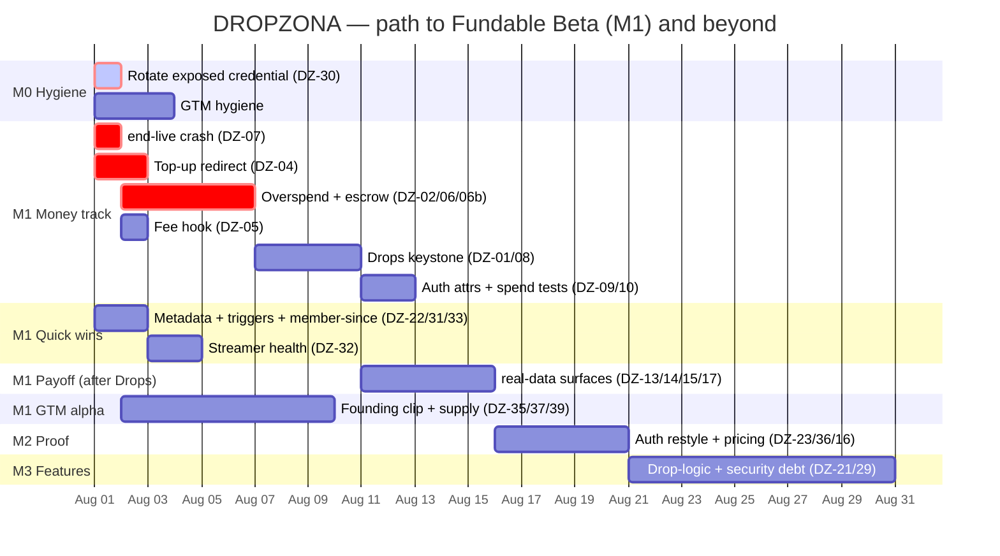

# DROPZONA — Product Roadmap

> **CS2 skin-giveaway automation for Twitch streamers** — a viewer joins a free giveaway in chat, a Steam GSI event (an ace, a clutch) triggers a draw, and the winner is delivered a real skin. Free tool; ~10% service fee on prize spend after beta; **viewers never pay**.

**Current focus:** `M1 · Fundable Beta` — the money-**IN** wallet is shipped; the remaining gap is a handful of `S`/`M` tickets, not a rewrite.
**Grounded in:** the code-verified strategy pack, reconciled against prod `HEAD 61d0e5a` (branch `prod`, 2026-07-22), and kept in sync with the ticket set in [`.github/roadmap-data.json`](.github/roadmap-data.json) (the single source of truth for ticket IDs).
**Companion docs:** [README](README.md) · [CONTRIBUTING](CONTRIBUTING.md) · [backend money track](docs/roadmap/backend-money-track.md) · [frontend placeholders](docs/roadmap/frontend-placeholders.md) · [GTM & budget](docs/roadmap/gtm-and-budget.md) · [process](docs/roadmap/process.md).
**Last synced:** 2026-08-01.

---

## Legend

| Field | Values |
|---|---|
| **Milestone** | `M0` Truth & Hygiene · `M1` Fundable Beta *(now)* · `M2` Proof & Public Beta · `M3` Retention & Moat |
| **Status** | **Now** (active sprint) · **Next** (queued) · **Later** (committed, unscheduled) · **Parked** (deferred by decision/gate) · **Done** (shipped, verified in code) |
| **Priority** | 🔴 `P0` blocks revenue/launch or a live bug · 🟠 `P1` trust/feature · 🟡 `P2` polish/debt |
| **Effort** | `S` ≤ ½ day · `M` ≤ 2 days · `L` ≤ 1 week |
| **Area** | Backend · Frontend · Infra · Security · GTM |
| **Type** | Bug · Feature · Chore · Epic |

**GitHub labels are slash-delimited**, matching `.github/roadmap-data.json`: `priority/P0`…`priority/P2`, `effort/S`…`effort/L`, `area/{backend,frontend,infra,security,gtm}`, `type/{bug,feature,chore,epic}`, `status/{now,next,later,parked,done}`.

**Ticket IDs** are stable across every roadmap doc — always the canonical `DZ-xx` from `roadmap-data.json`. A **`†`** marks a *split ticket* — part shipped, part open (e.g. the wallet ledger landed under `DZ-02`, but the overspend floor-guard has not). Split tickets appear in both **Done** and an active column, with the open slice named in the description. (There is no `DZ-44`.)

**Epics:** `DZ-41` tracks M1 (money + persistence + stability); `DZ-42` tracks the placeholder surfaces (Epic C); `DZ-43` is the standing casino-monetization decision.

---

## 🚩 Read first — the three things that gate everything

1. **`DZ-30` is a live incident, not a backlog item.** An exposed CI/bot credential is committed to the public production repo. **Rotate it, purge it from git history, and move to env-injected secrets — today.** Handling detail (files, commit, the credential itself) is deliberately kept out of this repo and lives in the internal security note.
2. **Two CONFIRMED `P0` money-loss risks block a funded stream** — the **overspend** hardening (`DZ-02` / `DZ-06`) and the **escrow-rollback refund** gap (`DZ-06b`). Both are stated below at a risk/acceptance level only. No streamer funds a balance until a draw provably cannot overspend it and cannot leave the streamer debited for a trade that later rolls back.
3. **`Drops` + `DrawAudit` persistence (`DZ-01` / `DZ-08`) is the keystone.** The orchestrator draws, buys, delivers, and debits — and persists *nothing*. That one missing write-path is the root cause behind **most** placeholder pages. It is already on the P0 money track, so filling those gaps is the payoff of finishing `DZ-08`, not a new project.

> **Open-P0 load:** M1 is gated by **nine open P0 tickets** (`DZ-01`, `DZ-02`, `DZ-04`, `DZ-05`, `DZ-06`, `DZ-06b`, `DZ-07`, `DZ-08`, `DZ-09`) **plus the `DZ-30` security incident** — ten open P0s in all. `DZ-03` is the one P0 already done.

---

# 📋 Board view

### 🟢 Now — active sprint

| ID | Item | Milestone | Priority | Effort | Area | Description |
|---|---|:--:|:--:|:--:|---|---|
| `DZ-30` | 🔒 Rotate exposed CI/bot credential | `M0` | 🔴 P0 | S | Security | Rotate the committed credential at source, purge it from full git history, and move to env-injected secrets. Detail in the internal security note — never pasted here. |
| `DZ-07` | Fix `end-live` NRE crash | `M1` | 🔴 P0 | S | Backend | The stream-session state store is used but never injected → NullReferenceException on **every** `end-live`. Inject the dependency + add a regression test. |
| `DZ-02†` | Overspend hardening on balance deduction | `M1` | 🔴 P0 | M | Backend | **Confirmed money-loss risk:** under concurrent draws a streamer balance can be overspent and driven negative. Harden the deduction into an atomic, floor-guarded (`≥ 0`), row-locked write that re-reads the balance inside the transaction. *(Ledger persistence already shipped — see Done.)* |
| `DZ-04†` | Finish top-up redirect | `M1` | 🔴 P0 | M | Frontend | Consume the checkout `hostedUrl` (full-page redirect); handle `?topup=success` (poll → `router.replace`) and `?topup=cancelled`. Without it, the finished backend top-up is **unreachable from the UI**. *(Real-data layer already shipped — see Done.)* |
| `DZ-22` | App metadata + SEO | `M1` | 🟠 P1 | S | Frontend | Title template (`%s \| Dropzona`), description, OG/Twitter tags; fix the leftover `"Drops \| Auth"` title. Runs while the backend builds. |
| `DZ-31` | Dashboard triggers-summary | `M1` | 🟠 P1 | S | Frontend | Re-map the commented markup to the live `GameTrigger` shape; reuses the already-working triggers API. **No backend.** *(Quick win.)* |
| `DZ-32` | New `GET /streamer/health` endpoint | `M1` | 🟠 P1 | M | Backend | Aggregate session presence + live check + a new GSI last-seen timestamp; ship the 3 derivable rows (UI already commented), stub the trade-queue row until `DZ-08`. *(Quick win.)* |
| `DZ-33` | Fix "Member since" (shows today) | `M1` | 🟠 P1 | S | Frontend | Live bug: the profile computes the date with `new Date()`. Surface the real `CreatedAt` via `/user/me`. *(Quick win / Bug.)* |
| `DZ-35` | GTM: capture the founding clip | `M1` | 🟠 P1 | L | GTM | Run the white-glove alpha with **manually-funded** prizes; capture one 15–30s "ace → winner drawn → trade sent" master clip + 9:16 cuts. Does **not** need the wallet finished. Gates the whole channel plan. |
| `DZ-37` | GTM: ShadowPay Msg #2 + open SkinsBack | `M1` | 🟠 P1 | S | GTM | Send the pre-written supply Message #2 (lead with the refundable-float ask); open SkinsBack in parallel. Engineering is done — this gates **funding**, not code. Do not wire any float without written refundable terms. |
| `DZ-38` | GTM: reserve @dropzona · waitlist · OG/robots | `M0` | 🟠 P1 | S | GTM | Reserve the handle, stand up the waitlist ESP, and fix OG cards + `robots.txt` (it still points at a stale **dropzona.com** reference — correct it to **dropzona.tv**). Decide buy-or-purge on the squattable .com. |

### 🔵 Next — queued behind the P0 spine

| ID | Item | Milestone | Priority | Effort | Area | Description |
|---|---|:--:|:--:|:--:|---|---|
| `DZ-06` | Orchestrator money-flow hardening | `M1` | 🔴 P0 | M | Backend | Fold the balance check + deduct into one transaction, and make purchases idempotent on `custom_id` so a delivery retry can never buy twice. Acceptance: deduction is atomic with the check; a retry cannot double-deliver. |
| `DZ-06b` | Escrow-rollback refund path | `M1` | 🔴 P0 | M | Backend | **Confirmed money-loss risk:** an escrow/hold trade is treated as final delivery and the streamer is debited, but Steam can roll it back days later — leaving the winner with nothing and the streamer still debited. Fix: count delivery only on a terminal accepted state, and refund the ledger (mark the drop failed) on any rollback. |
| `DZ-05` | Platform fee hook (ship at 0%) | `M1` | 🔴 P0 | S | Backend | `PlatformFeePct` applied at deduction, default 0%. Turning on the ~10% service fee later becomes a config flip, not a release. |
| `DZ-01†` | `Drops` + `DrawAudit` tables | `M1` | 🔴 P0 | M | Backend | Add the Drops/DrawAudit entities + one EF migration. *(The money tables already shipped — this is the drops half.)* |
| `DZ-08` | Persist every drop *(keystone)* | `M1` | 🔴 P0 | M | Backend | Orchestrator writes a Drops + DrawAudit row per giveaway; swap `new Random()` for a seeded/crypto draw; record entrant count; add scoped read endpoints. **Unblocks most placeholder surfaces.** |
| `DZ-09` | Restore auth attributes | `M1` | 🔴 P0 | S | Backend | Re-enable class-level `[Authorize]`/`[RequireUserId]` on the streaming controller; delete the commented test scaffold + dead `getuser` endpoint. |
| `DZ-10†` | Extend tests to the spend / end-live paths | `M1` | 🟠 P1 | S | Backend | Extend the ~25 money-IN tests to the spend / overspend / `end-live` paths. Mandatory merge gate on `DZ-02`/`DZ-05`/`DZ-06`/`DZ-06b`/`DZ-07`. *(Money-IN coverage already shipped — see Done.)* |
| `DZ-34` | Reconcile `maxDropsPerWiewer` typo | `M1` | 🟡 P2 | S | Frontend | Settle the canonical `maxDropsPerViewer` name across schema/defaults/controller now — before `DZ-21` builds real persistence on top of it. |
| `DZ-11` | Rules-of-Hooks crash risk | `M2` | 🟠 P1 | S | Frontend | `ShareOption` early-returns before its hooks → toggling Steam connection can crash React. Hooks before conditionals; enable the lint rule; fix the "Opps!" copy. |
| `DZ-16` | Coming-soon dead buttons | `M2` | 🟠 P1 | S | Frontend | "Back to App" / "Request a Feature" have no handlers on 5+ pages. Back → `router.back()`; Request → support form / Discord. |
| `DZ-23` | Auth restyle to landing brand | `M2` | 🟠 P1 | M | Frontend | Restyle `/auth` by hand against HEAD (the Jul-3 patch was never applied); keep passive consent; delete the dead `TermsAndPrivacy` component. |
| `DZ-24` | Typo sweep (user-facing first) | `M2` | 🟡 P2 | S | Frontend | Withdrow/Withdrowal, "Russion", "Opps!", "and and", stray dev strings; mechanical identifier renames as a follow-up PR. |
| `DZ-39` | GTM: targeting shortlist + concierge outreach | `M1` | 🟠 P1 | M | GTM | Build the 150–250-name shortlist (SullyGnome + TwitchTracker; 50–800 CCV, English, active CS2); run 10–20 concierge outreaches; seed 8–10 alpha streamers at $30–50, fee 0, grandfathered 90 days. |

### 🟣 Later — committed, unscheduled

| ID | Item | Milestone | Priority | Effort | Area | Description |
|---|---|:--:|:--:|:--:|---|---|
| `DZ-13` | Dashboard on real data (stats + event feed) | `M2` | 🟠 P1 | M | Frontend | Build all four stat cards behind one `GET /streamer/dashboard-stats` (never 2-of-4); relabel "Viewers" → **"Eligible viewers"**; wire the event feed to Drops data (with optional SSE/SignalR realtime) — replacing the fake s1mple/ZywOo "Live" feed. |
| `DZ-14` | History on real data | `M2` | 🟠 P1 | S | Frontend | Wire `RewardsTable` to streamer-scoped Drops; wire or remove the dead Filter/Export buttons; drop the 30-row mock storage. |
| `DZ-15` | Viewer my-drops on real data | `M2` | 🟠 P1 | S | Frontend | The viewer's win-proof / shareable-brag surface (**GTM cares most**). Swap the const-context for a viewer-scoped query hook once Drops lands. |
| `DZ-17` | Profile realness (badge, Statistics, Prizes) | `M2` | 🟠 P1 | M | Frontend | Derive the participation badge from real activity; wire Statistics to Drops aggregates; replace the My Prizes mock consts with a real prize grid over the drops read endpoint. |
| `DZ-25` | Dead-code purge | `M2` | 🟡 P2 | S | Frontend | Remove the commented "10 LIVE" pill, unused imports, fake sidebar badges, commented middleware/sidebar entries — keep only what has a ticket. |
| `DZ-26` | Version wordmark from config | `M2` | 🟡 P2 | S | Frontend | Hardcoded "BETA v0.4" → read from package/config. |
| `DZ-27` | Setup-wizard finish dialog | `M2` | 🟡 P2 | S | Frontend | Derive step statuses from real user state (Twitch, Steam, GSI, triggers) instead of fixed consts. |
| `DZ-36` | GTM: publish beta pricing + clip in the funnel | `M2` | 🟠 P1 | S | GTM | On the live marketing site (dropzona.tv): publish "free during beta · ~10% after · viewers never pay", drop the founding clip (`DZ-35`) into the "Live demo — coming soon" slot, and ship the comparison/SEO pages. |
| `DZ-40` | GTM: commission the legal review | `M2` | 🟠 P1 | M | GTM | Funded M2 line item ($1,200 fixed-fee startup package): entity + jurisdiction, sweepstakes, stored-value/money-transmission on the no-custody structure, crypto-AML. Retires risk R5 before public launch. |
| `DZ-29` | Security debt hardening | `M3` | 🟡 P2 | M | Security | Rate-limit + rotation for the anonymous GSI ingest credential; encrypt stored platform tokens at rest. |
| `DZ-21` | Drop Logic + Viewer Requirements | `M3` | 🟡 P2 | L | Frontend | New rule fields (cooldown / watch-time / dedup / gates) + **real orchestrator enforcement** + the save mutation the commented form lacks. Anti-farming — protects the money layer. |

### ⚫ Parked — deferred by decision or gate

| ID | Item | Milestone | Priority | Effort | Area | Description |
|---|---|:--:|:--:|:--:|---|---|
| `DZ-18` | Real "Switch to Streamer" activation | `M3` | 🟠 P1 | M | Backend | Today it's a bare `<Link>`; no role-switch endpoint exists on either side. **Blocked on owner decision `DZ-D2`** (what makes a viewer a streamer). |
| `DZ-19` | Skin-pool slice: kill or spec | `M3` | 🟠 P1 | S | Frontend | Orphaned mock slice, no route, backend ignores any pool concept. **Recommend: delete now** (decision `DZ-D4`), re-spec later only if streamers ask. |
| `DZ-20` | Stream-info / live-streams: park | `M3` | 🟠 P1 | S | Frontend | The same fake stream for every id, unreachable via nav. Park behind coming-soon **and delete the mock storages** (decision `DZ-D4`) — don't leave half-mounted mocks. |
| `DZ-28` | i18n / language menu | `M3` | 🟡 P2 | S | Frontend | The "Soon" overlay is the only i18n surface; RU/BR is on the M3 GTM path. Park consciously. |
| `DZ-12` | Multi-instance re-architecture | `M3` | 🟡 P2 | L | Infra | All runtime state is in-memory singletons; two instances break everything — including any lock added for `DZ-02`, which only holds within one process. **Keep to 1 backend instance**; move to DB/Redis at M3. |
| `DZ-43` | ❌ **Casino on any surface** — permanent NO | `M0` | 🟡 P2 | S | GTM | **Standing decision, recorded so it is not re-litigated.** A named Twitch ToS violation (streamers suspended + OAuth revoked) and a Valve-association risk; the "walled-off NewCo" hatch is a **licensing dead-end for the US/UK/EU audience**. Do not reopen without gambling counsel confirming a license that legally reaches the audience. |
| — | Discovery / social graph (follow feed, followings) | `M3` | — | — | — | **Strategy non-goal until 500+ weekly-active streamers** — a social graph maintained for no one. No ticket; don't build. |

### ✅ Done — shipped & verified in code

| ID | Item | Milestone | Priority | Effort | Area | Evidence / note |
|---|---|:--:|:--:|:--:|---|---|
| `DZ-03` | OpenSettle wallet backend (money-**IN**) | `M1` | 🔴 P0 | L | Backend | `GET /wallet`, `POST /wallet/top-up` → `hostedUrl`, signature-verified + idempotent + `fullySettled`-gated webhook. Matches the rev2 amount-only spec. |
| `DZ-45` | INFRA: .NET 10 bump + deploy path | `M1` | 🟠 P1 | M | Infra | csproj/Dockerfile on `net10.0`; DI + compose + Caddy wired; the OpenSettle webhook is public at `api.dropzona.tv/wallet/webhook/opensettle`. |
| `DZ-01†` | Money ledger tables | `M1` | 🔴 P0 | M | Backend | `StreamerBalances` + `WalletTransactions` (migration shipped). **Drops/DrawAudit tables still open → `DZ-01†`/`DZ-08` above.** |
| `DZ-02†` | Persisted balance ledger | `M1` | 🔴 P0 | M | Backend | Replaces the stubbed balance; survives restart. **Overspend hardening still open → active `DZ-02†` above.** |
| `DZ-04†` | Wallet real-data layer | `M1` | 🔴 P0 | M | Frontend | Mock arrays gone; live query + mutation; amount-only form. **Top-up redirect still open → active `DZ-04†` above.** |
| `DZ-10†` | Money-IN test coverage | `M1` | 🟠 P1 | M | Backend | ~25 Testcontainers Postgres money-path tests. **Spend/end-live coverage still open → `DZ-10†` above.** |
| `DZ-D1` | Top-up min/max bounds | `M1` | 🔴 P0 | S | Backend | `$10` / `$5,000` wired *(flagged `// CONFIRM` — see owner decisions on the rail + the `$0.01` compose min)*. |
| — | Core loop + Jun-19 UI batch | `M0` | 🟠 P1 | — | Full | Auth, GSI ingestion, trigger rules, winner pick, ShadowPay buy-and-deliver, go-live, contact form; triggers page wired, delete-account chain, giveaway-connection states, real logo/proxy. |

---

# 🎯 Milestone view

## `M0` — Truth & Hygiene
**Goal:** make the repo honest and safe, and stand up the founding-story groundwork — no exposed secrets, links that unfurl, and no re-litigated non-goals.
**Exit criteria:** exposed credential rotated + purged from history + env-injected (`DZ-30`) · handle reserved, waitlist live, OG/robots corrected to **dropzona.tv**, .com decision recorded (`DZ-38`) · casino monetization recorded as a permanent non-goal (`DZ-43`).

- [x] `DZ-30` · Rotate exposed CI/bot credential *(Now)*
- [ ] `DZ-38` · Reserve @dropzona · waitlist · OG/robots *(Now)*
- [x] `DZ-43` · DECISION: no casino monetization — permanent *(Parked / recorded)*

> `DZ-30` is checked because it is *assigned and in progress today* — it is not "complete" until history is purged and the credential is rotated. Treat it as the one item that cannot slip.

## `M1` — Fundable Beta *(current focus, epic `DZ-41`)*
**Goal:** a real dollar tops up from the UI, a real draw spends it **safely**, everything persists, and there are **no mock numbers** anywhere a funded streamer can navigate — while the white-glove alpha captures the founding clip.

**Exit criteria — Definition of Done scorecard** *(8 of 9 open; `DZ-03` done; all remaining tickets are `S`/`M`, ~1.5–2 sprints):*

| # | DoD item | Status |
|---|---|:--:|
| 1 | Top-up backend lands as persisted, **spendable** balance | ✅ `DZ-03` done |
| 2 | Top-up completes from the UI (redirect + poll) | 🔴 `DZ-04` redirect open |
| 3 | Concurrent triggers **cannot** overspend | 🔴 `DZ-02` / `DZ-06` |
| 4 | Cancelled / escrow-rolled-back trade refunds the ledger | 🔴 `DZ-06b` |
| 5 | `end-live` doesn't crash | 🔴 `DZ-07` |
| 6 | Every drop has a `Drops` + `DrawAudit` row | 🔴 `DZ-01` / `DZ-08` |
| 7 | Fee hook configurable, held at 0% | 🔴 `DZ-05` |
| 8 | `dotnet test` green with spend / end-live coverage | 🔴 `DZ-10` |
| 9 | No user-visible mock numbers where a funded streamer navigates | 🔴 `DZ-13`/`DZ-14`/`DZ-15`/`DZ-17` |

<b>M1 tickets</b> (task list)

**P0 money & stability**
- [x] `DZ-03` · OpenSettle wallet backend *(Done)*
- [x] `DZ-01†` · Money ledger tables *(Done — drops half open)*
- [x] `DZ-02†` · Persisted balance ledger *(Done — overspend hardening open)*
- [x] `DZ-04†` · Wallet real-data layer *(Done — redirect open)*
- [ ] `DZ-07` · `end-live` crash fix
- [ ] `DZ-02†` · Overspend hardening
- [ ] `DZ-06` · Orchestrator money-flow hardening
- [ ] `DZ-06b` · Escrow-rollback refund path
- [ ] `DZ-04†` · Finish top-up redirect
- [ ] `DZ-05` · Platform fee hook (0%)
- [ ] `DZ-01†` / `DZ-08` · Drops + DrawAudit persistence *(keystone)*
- [ ] `DZ-09` · Restore auth attributes
- [ ] `DZ-10†` · Spend / end-live test coverage

**Quick wins (parallel, no critical-path cost)**
- [ ] `DZ-22` · App metadata + SEO
- [ ] `DZ-31` · Dashboard triggers-summary
- [ ] `DZ-32` · `GET /streamer/health`
- [ ] `DZ-33` · "Member since" bug fix
- [ ] `DZ-34` · Reconcile `maxDropsPerViewer` typo

**GTM alpha (parallel — the founding-story track)**
- [ ] `DZ-35` · Capture the founding clip
- [ ] `DZ-37` · ShadowPay Msg #2 + SkinsBack
- [ ] `DZ-39` · Targeting shortlist + concierge outreach

**Shipped infra**
- [x] `DZ-45` · .NET 10 bump + deploy path *(Done)*

## `M2` — Proof & Public Beta *(placeholder epic `DZ-42`)*
**Goal:** a demo-clean app and the first social proof — real-data surfaces (no mock numbers), restyled auth, no dead buttons, pricing published, the founding clip live in the funnel, and a legal read done.
**Exit criteria:** `/auth` restyled to the landing brand · every coming-soon CTA wired · dashboard/history/my-drops/profile on real data · pricing page published · founding clip in the live-demo slot · legal review retiring risk R5 · **25+ activated streamers**.

- [ ] `DZ-13` · Dashboard on real data
- [ ] `DZ-14` · History on real data
- [ ] `DZ-15` · Viewer my-drops on real data
- [ ] `DZ-17` · Profile realness
- [ ] `DZ-11` · Rules-of-Hooks crash risk
- [ ] `DZ-16` · Coming-soon dead buttons
- [ ] `DZ-23` · Auth restyle to landing brand
- [ ] `DZ-24` · Typo sweep
- [ ] `DZ-25` · Dead-code purge
- [ ] `DZ-26` · Version wordmark from config
- [ ] `DZ-27` · Setup-wizard finish dialog
- [ ] `DZ-36` · Publish pricing + founding clip in the funnel
- [ ] `DZ-40` · Commission the legal review

## `M3` — Retention & Moat
**Goal:** turn the keystone into stickiness and defend the money layer; get scale-ready.
**Exit criteria:** anti-farming drop-logic enforced in the orchestrator · security debt closed · multi-instance path documented/started · role-switch, skin-pool, stream-info, i18n, and the discovery graph deliberately parked until there is usage to retain.

- [ ] `DZ-21` · Drop Logic + Viewer Requirements
- [ ] `DZ-29` · Security debt hardening
- [ ] `DZ-18` · Real "Switch to Streamer" *(needs `DZ-D2`)* — **Parked**
- [ ] `DZ-19` · Skin-pool slice: kill or spec — **Parked**
- [ ] `DZ-20` · Stream-info / live-streams — **Parked**
- [ ] `DZ-28` · i18n / language menu — **Parked**
- [ ] `DZ-12` · Multi-instance re-architecture — **Parked**
- Discovery / social graph — **non-goal pre-scale** (no ticket)

---

# 🗓️ Timeline

Two tracks run in parallel: the **M1 money track** (P0 spine) and the **placeholder track** (quick wins → keystone → payoff → features), with the **GTM alpha** running alongside. They converge at the keystone (`DZ-08`).

### Sprint plan

| Sprint | Theme | Tickets | Exit |
|:--:|---|---|---|
| **A** | Quick wins *(parallel to money P0)* | `DZ-30` (today) · `DZ-07` · `DZ-22` · `DZ-31` · `DZ-32` · `DZ-33` · `DZ-34` | 3 "COMING SOON"s + 1 live bug gone; secret rotated |
| **B** | Keystone *(this **is** the money sprint)* | `DZ-02` · `DZ-06` · `DZ-06b` · `DZ-05` · `DZ-01` + `DZ-08` · `DZ-04` finish · `DZ-09` · `DZ-10` finish | **M1 money DoD met** — real USDC in, a safe draw spends it, every drop persisted |
| **C** | Payoff *(after B lands)* | `DZ-13` · `DZ-14` · `DZ-15` · `DZ-17` | DoD #9 cleared — no mock numbers a funded streamer can reach → **M1 complete** |
| **D** | Net-new features & proof | `DZ-21` · `DZ-23` · `DZ-16` · `DZ-36` · `DZ-40` | Retention surfaces + brand-clean demo → **M2/M3** |
| **GTM** | Founding-story track *(parallel throughout)* | `DZ-38` · `DZ-35` · `DZ-37` · `DZ-39` · `DZ-36` | Clip captured, supply unfrozen, shortlist + alpha seeded |
| **E** | Parked | `DZ-18` · `DZ-19` · `DZ-20` · `DZ-28` · `DZ-12` | Do **not** build — discovery graph waits for 500+ WAS |

### Gantt

---

# 🔑 Owner decisions blocking sign-off

Resolve on one 30-min call; recommendations carried from the strategy pack.

| Decision | Blocks | Recommendation |
|---|---|---|
| **`DZ-D1`** · chain/token + min/max | `DZ-03`/`DZ-04` sign-off, live top-ups | Keep `$10`/`$5,000`; **fix the `$0.01` compose min** (below the processor floor → will 400). **Confirm the settlement rail with OpenSettle** (code pins one rail, the spec names another) before checkouts succeed. The one external confirm — do it first. |
| **`DZ-D3`** · WinnersCount | `DZ-08` | For M1, **always draw 1 and hide the input**. Revisit multi-winner post-beta. |
| **`DZ-D2`** · Role-switch semantics | `DZ-18` | Define what makes a viewer a streamer (Steam+GSI connected? explicit activation?). Parkable — decide, not urgent. |
| **`DZ-D4`** · Skin-pool / stream-info | `DZ-19`/`DZ-20` | Kill the skin-pool slice; park stream-info with mock storages deleted. |
| **OPS / funding** | going live | Supply the VPS secrets (OpenSettle keys + register the webhook to obtain its signing secret) and decide the ShadowPay float **under the standing do-not-deposit-without-written-refundable-float rule**. |

---

# 📌 Standing rules (do not violate without a written decision)

1. **No ShadowPay deposit** before a refundable/withdrawable float is agreed **in writing** (SkinBid's Nov-2025 bankruptcy turned funded balances into unsecured claims).
2. **No paid ad spend** before the founding clip (`DZ-35`) exists and OG cards unfurl on dropzona.tv.
3. **No sub-gated / paid-entry mechanics** — free entry, random, equal odds only.
4. **No custody** — Dropzona never holds crypto or runs trade bots; inbound-only wallet.
5. **No casino on any product/Twitch/Steam surface — ever** *(see `DZ-43`)*.

---

Every ticket, file, and claim in this roadmap was verified against the production codebase at `HEAD 61d0e5a` and reconciled to the canonical ticket set in `.github/roadmap-data.json`. Secret values, exact vulnerable file paths, and credential detail are intentionally excluded from this repo — see the internal security note.