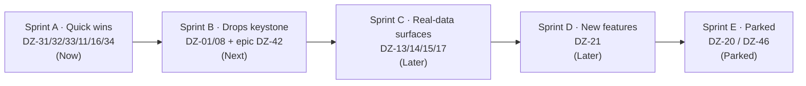

# Frontend Placeholders — Fill or Kill the Placeholder Surfaces

> **Epic:** `DZ-42` — fill or kill the placeholder surfaces (`type/epic` · `P1` · `L`) · **Area:** Frontend (+ a thin, well-scoped backend data layer) · **Milestone anchor:** Sprint A → Sprint D
> **Verified against:** `real production` @ HEAD `61d0e5a` (branch `prod`) via a full placeholder-surface audit + confirming screenshots of `/streamer/dashboard` and `/streamer/triggers`.
> **Companion doc:** [`supporting-backend.md`](supporting-backend.md) — the data/endpoints strictly needed to fill these placeholders. · **Board:** [`../../ROADMAP.md`](../../ROADMAP.md).

This is the developer-facing gap roadmap. Two frontend / full-stack devs use it to **fix existing broken UI** and **fill "Coming soon" placeholders with real logic** across 8 routes. It is scoped to exactly that: no pricing, no budget, no go-to-market. The only backend in scope is the data layer that makes these UIs show real numbers — spelled out in the companion doc.

---

## TL;DR

- **You don't have "so many gaps."** You have **one keystone** (drop-history persistence), **~6 free quick wins / bug fixes**, one net-new feature, and **a discovery graph you should not build yet.**
- **Most frontends already exist.** The panels are fully built and sitting **commented out behind `<ComingSoon/>`**. Once the drop-history data layer lands, wiring is cheap (`S` / `M`), not a rebuild.
- **Ship the quick wins now** (zero data-layer dependency), land the drop-history persistence next, then light up the real-data surfaces the day it lands.

---

## The one insight that orders everything: **drop-history persistence is the keystone**

Today `GiveawayOrchestrator.StartGiveaway` draws a winner and delivers a skin — then **persists nothing.** The result is only *logged*. There is **no `Drops` table, no `DrawAudit` table, no entity, no migration.**

That single missing write-path is the root cause behind **most** placeholders: dashboard stats + feed, streamer history, profile Statistics / My Prizes, and viewer my-drops all have **no data to render.**

```
        ┌─────────────────────────────────────────────┐
        │   DZ-01 / DZ-08  Drops + DrawAudit persist   │   ← KEYSTONE
        └───────────────────────┬─────────────────────┘
                                 │ unlocks (data now exists)
   ┌──────────────┬─────────────┼──────────────┬──────────────────┐
   ▼              ▼             ▼              ▼                  ▼
 Dashboard     /streamer     Profile        /viewer          Dashboard
 4 stat cards   /history     realness       /my-drops        event feed
 (DZ-13)        (DZ-14)      (DZ-17)         (DZ-15)          (DZ-13)
```

The write-path is also the **audit trail** — an entrant snapshot + count + winner recorded per draw is the answer to the "was it rigged?" trust question, and the source behind the win-proof surface (`/viewer/my-drops`). Its full spec lives in [`supporting-backend.md`](supporting-backend.md); this doc treats it as the dependency the frontends wait on.

> **The move:** ship the quick wins **now** (they never touch the keystone), land drop-history persistence next, then wire the real-data surfaces the moment it lands. **Park the discovery graph.**

---

## The 8 routes / zones → 4 buckets

Legend — **BE status:** ✅ ready · 🟡 partial/in-memory · 🔴 needs the data layer · **Buckets:** 🟢 Quick win · 🟠 Unlocked-by-Drops · 🔵 New feature · ⚫ Parked

| Ticket | Route / zone | What you see now | Data/endpoint it needs | BE status | Frontend state | Effort | Bucket |
|:--|:--|:--|:--|:--:|:--|:--:|:--|
| `DZ-31` | **Dashboard · Triggers-summary** | `Coming soon` | the trigger rules that already work on `/triggers` | ✅ | commented, ready | **S** | 🟢 Quick win |
| `DZ-32` | **`/streamer/health`** | placeholder | session presence + is-live + GSI last-seen | 🟡 | full UI commented | **M** | 🟢 Quick win |
| `DZ-33` | **Profile · "Member since"** | always shows *today* (bug) | `CreatedAt` (already persisted) | ✅ | 1-line fix | **S** | 🟢 Quick win |
| `DZ-11` | **Profile · ShareOption** | crash / `Opps!` typo | none | ✅ | build bug | **S** | 🟢 Quick win |
| `DZ-16` | **Coming-soon widget buttons** | dead `Back to App` / `Request a Feature` | none | ✅ | build bug | **S** | 🟢 Quick win |
| `DZ-34` | **Triggers · `maxDropsPerWiewer` typo** | mis-spelled field | none | ✅ | rename | **S** | 🟢 Quick win |
| `DZ-13` | **Dashboard · 4 stat cards + event feed** | 4× `Coming soon` + a **fake** "Live" feed | drops aggregate + drops event log | 🔴 needs Drops | commented | **M** | 🟠 Unlocked |
| `DZ-14` | **`/streamer/history`** | placeholder | drops (streamer-scoped) | 🔴 needs Drops | full table commented | **S** | 🟠 Unlocked |
| `DZ-15` | **`/viewer/my-drops`** | placeholder | drops (by winner) + delivery status | 🔴 needs Drops | full UI commented | **S** | 🟠 Unlocked |
| `DZ-17` | **Profile · Statistics + My Prizes** | `Coming soon` | drops aggregate + per-user drops | 🔴 needs Drops | mixed (some commented, prize-grid new) | **M** | 🟠 Unlocked |
| `DZ-21` | **Triggers · Drop Logic + Viewer Requirements** | 2× `Coming soon` | **new** rule fields + orchestrator enforcement + save mutation | 🔴 new feature | forms exist, **no save** | **L** | 🔵 New feature |
| `DZ-20` | **`/viewer/live-streams`** directory | placeholder | list of live sessions | 🟡 | full UI commented | **S** | ⚫ Parked |
| `DZ-46` | **`/viewer/followings`** | placeholder | **net-new** follow entity + endpoints | 🔴 net-new | **no markup** | **L** | ⚫ Parked |

> **Screenshot-confirmed:** `/streamer/dashboard` shows 4 stat cards reading "Coming soon", a **fake** "Live" feed (hardcoded creator names), and a Triggers-summary panel reading "Coming soon". `/streamer/triggers` shows the Game-Triggers list **working**, while "Drop Logic" and "Viewer Requirements" both read "Coming soon".

---

## Bucket 1 — 🟢 Quick wins (Sprint A · Stage: Now)

*Buildable now over data the backend already has — no drop-history layer needed. Deletes a `Coming soon` panel and clears several live bugs off the streamer + profile surfaces.*

### `DZ-31` — Dashboard Triggers-summary panel &nbsp; `P1` · `S` · `area/frontend` · `type/feature` · **Now**
- **Current state:** The dashboard's triggers-summary panel renders `<ComingSoon/>` with the real markup commented out — even though the underlying trigger rules **already work** on `/streamer/triggers`.
- **Backend dependency:** **None.** Reuse the existing giveaway-settings hook against the live triggers contract.
- **Frontend readiness:** Commented markup exists; re-map it to the real `GameTrigger` shape (`triggerType` / `isEnabled` / `winnersCount` / `maxPrizeAmount` / `iconName`) and remove the `<ComingSoon/>` gate.
- **Acceptance:** Dashboard shows each configured game's live trigger state; toggling a trigger on `/triggers` is reflected on the dashboard after refetch; no mock rows remain.

### `DZ-32` — `/streamer/health` page &nbsp; `P1` · `M` · `area/backend+frontend` · `type/feature` · **Now**
- **Current state:** `/streamer/health` is a placeholder; the full status UI is already built and commented out.
- **Backend dependency:** 🟡 Mostly in-memory already. Needs a new `GET /streamer/health` (session presence + is-live + GSI last-seen) — spec in [`supporting-backend.md`](supporting-backend.md).
- **Frontend readiness:** Full UI commented. Ship the **3 derivable rows** (session present, stream live, last GSI seen); **leave the trade-queue row honestly stubbed** until a queue source exists.
- **Acceptance:** Page renders live values for the 3 derivable rows; last-seen updates as GSI packets arrive; no fabricated queue depth is shown.

### `DZ-33` — Profile "Member since" bug &nbsp; `P1` · `S` · `area/frontend` · `type/bug` · **Now**
- **Current state:** The profile "Member since" value **always renders today's date** — the component hardcodes `new Date()` instead of the real join date. Live trust bug on a page every streamer sees.
- **Backend dependency:** ✅ `UserPlatformInfo.CreatedAt` is **already persisted** — it just isn't surfaced on `/user/me`.
- **Frontend readiness:** 1-line fix once `CreatedAt` is on the `UserData` type; replace the hardcoded `new Date()`.
- **Acceptance:** "Member since" shows the true account-creation date; a fresh account and an old account render different dates.

### `DZ-11` — Profile ShareOption rules-of-hooks crash + typo &nbsp; `P1` · `S` · `area/frontend` · `type/bug` · **Now**
- **Current state:** The profile ShareOption component **early-returns before its hooks run**, violating the React rules of hooks — it crashes/renders inconsistently. It also ships an `Opps!` typo (should read `Oops!`).
- **Backend dependency:** None.
- **Frontend readiness:** Move the early return **after** all hook calls (or hoist the hooks above the guard) so the hook order is stable; fix the `Opps!` string.
- **Acceptance:** The component mounts without a hooks-order warning/crash on every render path; the copy reads `Oops!`.

### `DZ-16` — Coming-soon widget dead buttons &nbsp; `P1` · `S` · `area/frontend` · `type/bug` · **Now**
- **Current state:** The shared coming-soon widget renders `Back to App` and `Request a Feature` buttons that **do nothing** (no handler / no href). They appear on every parked surface.
- **Backend dependency:** None.
- **Frontend readiness:** Wire `Back to App` to route home (or `router.back()`); point `Request a Feature` at a real destination (mailto or the feedback link) — or remove it if there is no destination. No dead controls ship.
- **Acceptance:** Both buttons perform a visible action; there is no clickable-but-inert control left on the widget.

### `DZ-34` — Reconcile the `maxDropsPerWiewer` typo &nbsp; `P2` · `S` · `area/frontend` · `type/chore` · **Now**
- **Current state:** The field is mis-spelled `maxDropsPerWiewer` in the zod schema, the form defaults, and the controller field name.
- **Backend dependency:** None (name reconcile across schema/defaults/controller).
- **Frontend readiness:** Rename to the canonical `maxDropsPerViewer` everywhere; ensure the value round-trips.
- **Acceptance:** The field is spelled `maxDropsPerViewer` consistently across schema, defaults, and controller/DTO; the value round-trips; no reference to the old spelling remains.
- **Why now:** must be settled **before** `DZ-21` builds on that field.

---

## Bucket 2 — 🟠 Unlocked by Drops (Sprint C · Stage: Later)

*These are `<ComingSoon/>` panels with **fully-built markup commented out.** The only thing missing is data. Once the drop-history layer (`DZ-01` / `DZ-08`) lands, each is a swap of const-context for a query hook + delete the layout. Cheap.*

### `DZ-15` — `/viewer/my-drops` on real data &nbsp; `P1` · `S` · `area/frontend` · `type/feature` · **Later** &nbsp; 🔝 highest value
- **Current state:** The viewer's **win-proof surface** — fake `DropItem`s today, page is `ComingSoon`.
- **Backend dependency:** 🔴 drops filtered **by winner** + delivery status (`DZ-01` / `DZ-08`).
- **Frontend readiness:** Full UI commented. Swap const-context for a viewer drops query hook, uncomment, drop `ComingSoonLayout`. Stub "Watch Time" (no source yet) rather than faking it.
- **Acceptance:** A viewer who won a drop sees it with real skin, value, timestamp, and delivery state; a viewer with no wins sees the real empty state.

### `DZ-14` — `/streamer/history` on real data &nbsp; `P1` · `S` · `area/frontend` · `type/feature` · **Later**
- **Current state:** Fake rows; page renders coming-soon with the real `RewardsTable` commented out.
- **Backend dependency:** 🔴 streamer-scoped paginated drops read (`DZ-01` / `DZ-08`).
- **Frontend readiness:** Full table commented. Wire `RewardsTable` to the streamer drops hook; uncomment. Leave Filter/Export **decorative** until a customer asks (see [What NOT to build](#what-not-to-build-now)).
- **Acceptance:** History renders the streamer's real past drops, paginated; an account with no drops shows the real empty state.

### `DZ-13` — Dashboard on real data (stats cards + event feed) &nbsp; `P1` · `M` · `area/frontend` · `type/feature` · **Later**
- **Current state:** 4× `Coming soon` cards **and** a fake "Live" feed (hardcoded creator names, a literal "1189 today" badge).
- **Backend dependency:** 🔴 drops aggregate + drops event log (`DZ-01` / `DZ-08`). Build the four cards behind **one** dashboard-stats read — do not ship 2-of-4.
- **Frontend readiness:** Cards and feed markup are commented. Uncomment; feed them the aggregate + a drops read. **Relabel "Viewers" → "Eligible viewers"** — the cache only holds giveaway-joined viewers, not total concurrents (see [What NOT to build](#what-not-to-build-now)). A realtime transport is *not* required for v1 — poll/refetch is fine; the "Live" feel is a later enhancement.
- **Acceptance:** All four cards show real aggregates from Drops; the event feed shows real drops (no hardcoded creator names, no "1189 today" literal); no card claims a concurrents number the backend can't produce.

### `DZ-17` — Profile realness (Statistics + My Prizes + participation badge) &nbsp; `P1` · `M` · `area/frontend` · `type/feature` · **Later**
- **Current state:** Statistics panel is coming-soon over mock consts; My Prizes is `Coming soon` with only an empty-state (no prize-grid to uncomment); no participation badge.
- **Backend dependency:** 🔴 drops aggregate + per-user drops (`DZ-01` / `DZ-08`).
- **Frontend readiness:** Mixed — Statistics markup is commented (uncomment + feed aggregates); **My Prizes needs a net-new prize-grid** built over the per-user drops read; add a participation badge derived from drop count. *(The "Member since" bug on this same page is pulled forward as `DZ-33`.)*
- **Acceptance:** Statistics reflect real drop history (a new user shows zeros, not mock values); a user with prizes sees them in a grid with skin art + delivery state; the participation badge reflects real activity.

---

## Bucket 3 — 🔵 New feature (Sprint D · Stage: Later)

*Needs new backend, not just an uncomment.*

### `DZ-21` — Triggers phase 2: Drop Logic + Viewer Requirements &nbsp; `P2` · `L` · `area/backend+frontend` · `type/feature` · **Later**
- **Current state:** The Drop Logic + Viewer Requirements panels are **fully-built forms commented out** behind `<ComingSoon/>` — but the **backend has no fields for them**, and even the commented form **has no save wiring**. Today the winner pick is pure `Random()`: no cooldown, dedup, watch-time, subscriber, or account-age gate.
- **Backend dependency:** 🔴 **new feature.** New rule fields (`winnerSelection` / `minWatchTime` / `cooldown` / `maxDropsPerViewer` / `eventDedupWindow` + the viewer gates) + real orchestrator enforcement + a save mutation — spec in [`supporting-backend.md`](supporting-backend.md).
- **Frontend readiness:** Forms exist; build the **save mutation** they lack and wire the round-trip; remove the `<ComingSoon/>` gate.
- **Prerequisite:** the `maxDropsPerViewer` typo (`DZ-34`) must be settled first.
- **Value:** anti-farming — stops one viewer winning repeatedly and lets a streamer gate who's eligible.
- **Acceptance:** rules persist and round-trip through the form; the orchestrator **actually enforces** cooldown / dedup / watch-time / subscriber / account-age; a repeat-win farming pattern that succeeds today is blocked.

---

## Bucket 4 — ⚫ Parked (Sprint E · Stage: Parked)

*Decide, don't build now.*

### `DZ-20` — `/viewer/live-streams` directory &nbsp; `P2` · `S` · `area/frontend` · **Parked**
- Coming-soon over big mock sets. **Park or scope:** a directory is empty pre-scale — a page listing a handful of streamers is worse than none. Decide **kill vs minimal**; if kept parked, leave `<ComingSoon/>` and delete the mock storage so no half-mounted mock ships.

### `DZ-46` — `/viewer/followings` &nbsp; `P2` · `L` · `area/frontend+backend` · **Parked**
- **Net-new follow system** — no entity, no endpoint, **no markup** exists. **Park or build:** do not stand up a social graph pre-scale — you'd maintain a follow table for no one. Decide before any build.

See [What NOT to build now](#what-not-to-build-now) for the defensible rationale.

---

## Sprint sequence



### Sprint A · Quick wins — Stage: Now
> Clear the `Coming soon` panel + the live bugs off the streamer & profile surfaces. No data-layer dependency.
- [ ] `DZ-31` Dashboard Triggers-summary — reuse the giveaway-settings rules. **No backend.** — `S`
- [ ] `DZ-32` `/streamer/health` — new endpoint (presence + live + GSI last-seen), 3 rows, stub trade-queue. — `M`
- [ ] `DZ-33` "Member since" — surface `CreatedAt` via `/user/me`. — `S`
- [ ] `DZ-11` ShareOption rules-of-hooks crash + `Opps!` typo. — `S`
- [ ] `DZ-16` Coming-soon widget dead buttons. — `S`
- [ ] `DZ-34` Reconcile `maxDropsPerWiewer` → `maxDropsPerViewer` **before** `DZ-21`. — `S`

### Sprint B · Drops keystone — Stage: Next
> The drop-history **data layer** that unblocks the real-data surfaces. Framed as data/persistence. Full spec in [`supporting-backend.md`](supporting-backend.md).
- [ ] `DZ-01` `Drops` + `DrawAudit` tables/entities + migration. — `P0` · `M`
- [ ] `DZ-08` Orchestrator write-path (a `Drops` + `DrawAudit` row per giveaway) + streamer-scoped & viewer-scoped read endpoints. — `P0` · `M`
- [ ] `DZ-42` Epic umbrella for this repo — fill or kill the placeholder surfaces. — `P1` · `L`

### Sprint C · Real-data surfaces — Stage: Later
> Cheap once Drops lands; the real markup is already commented behind `<ComingSoon/>`.
- [ ] `DZ-15` `/viewer/my-drops` — highest value (win-proof). — `S`
- [ ] `DZ-14` `/streamer/history` — uncomment `RewardsTable` + streamer read hook. — `S`
- [ ] `DZ-13` Dashboard stats cards + event feed on real data; relabel "Viewers" → "Eligible viewers". — `M`
- [ ] `DZ-17` Profile realness — Statistics + My Prizes + participation badge. — `M`

### Sprint D · New features — Stage: Later
- [ ] `DZ-21` Drop Logic + Viewer Requirements — new rule fields + orchestrator enforcement + save mutation. — `L`

### Sprint E · Parked — Stage: Parked
- [ ] `DZ-20` `/viewer/live-streams` — park or scope (kill vs minimal).
- [ ] `DZ-46` `/viewer/followings` — park or build (needs a net-new follow system).

---

## Fix-existing bugs

*(the bugs that live inside these pages — all in Sprint A)*

| Ticket | Bug | Where (behavioral) | Sprint |
|:--|:--|:--|:--|
| `DZ-33` | **"Member since" always shows today** — join-date field hardcodes `new Date()` | Profile join-date field | A |
| `DZ-11` | **ShareOption rules-of-hooks crash** — early-return before hooks + `Opps!` typo | Profile ShareOption component | A |
| `DZ-16` | **Coming-soon widget dead buttons** — `Back to App` / `Request a Feature` do nothing | Shared coming-soon widget | A |
| `DZ-34` | **`maxDropsPerWiewer` misspelled** in the zod schema, form defaults, and the controller field name | Triggers config form + settings contract | A (before `DZ-21`) |
| `DZ-21` | **Drop Logic / Viewer Requirements have no save wiring** even in the commented markup | Triggers phase-2 forms | D (scope must include the mutation layer, not just an uncomment) |

---

## What NOT to build now

*Be able to defend each of these.*

**Discovery graph — `/viewer/live-streams` (`DZ-20`) + `/viewer/followings` (`DZ-46`): park both.**
Discovery is a *scale* feature. Pre-scale it is:
- **An empty directory.** A page listing a handful of streamers is worse than none — it advertises that the platform is tiny.
- **A follow table you maintain for no one.** `/viewer/followings` needs a **net-new follow entity + endpoints** with **no existing markup** — pure new build serving zero users.

Defense in one line: building discovery at ~0 activated streamers spends engineering on empty UI and a social graph nobody populates, while the keystone still blocks every real-data surface.

**Dashboard "Viewers" as a true audience number.** The session cache holds only **eligible** viewers (giveaway-joined + trade-link present), not total concurrents. **Relabel to "Eligible viewers"** in `DZ-13` — do not fake a concurrents number the backend cannot produce; a streamer will cross-check it against Twitch.

**History Filter / Export buttons.** Leave them **decorative** until a customer asks. Speculative surface area with no demand signal.

---

## Board snapshot

| Stage | Tickets |
|:--|:--|
| **Now** (Sprint A) | `DZ-31` · `DZ-32` · `DZ-33` · `DZ-11` · `DZ-16` · `DZ-34` |
| **Next** (Sprint B) | `DZ-01` · `DZ-08` · `DZ-42` |
| **Later** (Sprint C) | `DZ-13` · `DZ-14` · `DZ-15` · `DZ-17` |
| **Later** (Sprint D) | `DZ-21` |
| **Parked** (Sprint E) | `DZ-20` · `DZ-46` |

> **Blocked-on-keystone:** every 🟠 waits on `DZ-01` / `DZ-08` (Sprint B). They are **cheap wiring** afterward, not rebuilds. `DZ-21` needs its own new backend and `DZ-34` settled first.

---

*Bottom line: you don't have "so many gaps" — you have **one keystone** (drop-history persistence), **six quick wins / bug fixes**, one net-new feature, and **a discovery graph you shouldn't build yet.** Ship A now, B next, C the day B lands. That converts ~7 of the 8 placeholder surfaces with almost no work beyond the data layer the UI already assumes exists.*
