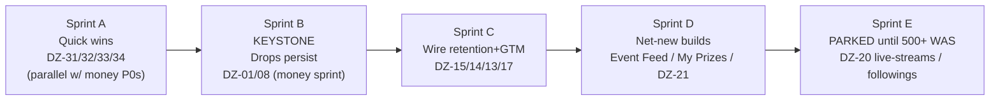

# Frontend Placeholders — The Placeholder-Fill Epic

> **Epic:** `DZ-42` — wire or kill the placeholder surfaces (Epic C) · **Area:** Frontend (+ thin Backend) · **Milestone anchor:** M1 → M2
> **Verified against:** `real production` @ HEAD `61d0e5a` (branch `prod`, 2026-07-22) via a full placeholder-surface audit, cross-checked against the money track (DZ-01…DZ-34).
> **Related repo docs:** `ROADMAP.md` (ticket board), `docs/roadmap/backend-money-track.md` (money / stability track), `docs/roadmap/gtm-and-budget.md` (GTM + budget).

Dropzona's app is littered with `COMING SOON` panels, `<ComingSoon/>` layouts, and mock data. This epic converts them to real product **without** treating it as a new project — because most of them share a single root cause.

---

## TL;DR

- **You don't have "so many gaps."** You have **one keystone** (Drops persistence), **~3 free quick wins**, a couple of net-new features, and **a discovery graph you should not build yet.**
- **The keystone is already on the money track.** Landing `Drops` + `DrawAudit` persistence (**DZ-01 / DZ-08**) is required for M1 "no mock numbers" anyway — so filling ~7 of the placeholders is the *payoff* of finishing the money sprint, not extra scope.
- **The frontends already exist.** Most panels are fully built and sitting **commented out behind `<ComingSoon/>`**. Once Drops lands, wiring is cheap (**S / M**), not a rebuild.
- **Ship 3 quick wins now** (zero money-track dependency), land Drops inside the money sprint, then light up retention + GTM surfaces the day it lands.

---

## The one insight that orders everything: **Drops persistence is the keystone**

Today `GiveawayOrchestrator.StartGiveaway` draws a winner, buys + delivers the skin, and debits the balance — then **persists nothing.** The result is only *logged*. There is **no `Drops` table, no `DrawAudit` table, no entity, no migration.**

That single missing write-path is the root cause behind **most** placeholders:

```
        ┌─────────────────────────────────────────────┐
        │   DZ-01 / DZ-08  Drops + DrawAudit persist   │   ← KEYSTONE
        └───────────────────────┬─────────────────────┘
                                │ unlocks (data now exists)
   ┌──────────────┬─────────────┼──────────────┬──────────────────┐
   ▼              ▼             ▼              ▼                  ▼
 Dashboard     /streamer     Profile        /viewer          Dashboard
 4 stat cards   /history     Statistics     /my-drops        Event Feed
 (DZ-13)        (DZ-14)      (DZ-17)         (DZ-15)          (DZ-13, +realtime)
```

Two consequences that make this a high-leverage move:

1. **It is already P0 on the money track.** It's a Fundable-Beta (M1) Definition-of-Done item ("every drop has a Drops+DrawAudit row"), tracked under the M1 epic `DZ-41`. We are paying for it regardless.
2. **It's also the dispute defense.** An auditable draw trail (entrant snapshot + count + winner + seed) is the answer to the "was it rigged?" trust risk — and the win-proof surface (`/viewer/my-drops`) that GTM cares about.

> **The move:** ship 3 zero-dependency quick wins **now** (they never touch the money-track critical path), land Drops inside the money sprint, then wire the retention + GTM surfaces the moment it lands. **Park the discovery graph.**

---

## The 8 routes / zones → 4 buckets

Legend — **Backend status:** ✅ ready · 🟡 partial/in-memory · 🔴 needs build · **Verdict buckets:** 🟢 Do-now · 🟠 Unlocked-by-Drops · 🔵 Build-later · ⚫ Parked

| Ticket | Route / zone | What you see now | Backend it needs | BE status | Frontend state | Effort | Bucket |
|:--|:--|:--|:--|:--:|:--|:--:|:--|
| `DZ-31` | **Dashboard · Triggers-summary** | `COMING SOON` | trigger rules that already work on `/triggers` | ✅ | commented, ready | **S** | 🟢 Do-now |
| `DZ-33` | **Profile · "Member since"** | always shows *today* (bug) | `CreatedAt` (already persisted) | ✅ | 1-line fix | **S** | 🟢 Do-now |
| `DZ-32` | **`/streamer/health`** | placeholder | session presence + `IsStreamLiveAsync` + new last-seen | 🟡 | full UI commented | **M** | 🟢 Do-now |
| `DZ-13` | **Dashboard · 4 stat cards** | 4× `COMING SOON` | drops-today / value-today aggregate | 🔴 needs Drops | commented | **M** | 🟠 Unlocked |
| `DZ-14` | **`/streamer/history`** | placeholder | drops (streamer-scoped) | 🔴 needs Drops | full table commented | **M** | 🟠 Unlocked |
| `DZ-15` | **`/viewer/my-drops`** | placeholder | drops (by winner) + delivery status | 🔴 needs Drops | full UI commented | **S–L** | 🟠 Unlocked |
| `DZ-17` | **Profile · Statistics** | `COMING SOON` | drops aggregate | 🔴 needs Drops | commented | **S** | 🟠 Unlocked |
| `DZ-13` | **Dashboard · Event Feed** | *fake* "Live" (s1mple/ZywOo) | drops event log **+ realtime transport** | 🔴 needs Drops + SSE | commented | **L** | 🔵 Build-later |
| `DZ-17` | **Profile · My Prizes** | `COMING SOON` | drops + **new** prize-grid UI | 🔴 new feature | empty-state only | **M** | 🔵 Build-later |
| `DZ-21` | **Triggers · Drop Logic + Viewer Requirements** | 2× `COMING SOON` | **new** rule fields + orchestrator enforcement + save mutation | 🔴 new feature | forms exist, **no save** | **L** | 🔵 Build-later |
| `DZ-20` | **`/viewer/live-streams`** directory | placeholder (viewer home) | list of live sessions | 🟡 | full UI commented | M | ⚫ Parked |
| `DZ-20` | **`/viewer/followings`** | placeholder | **net-new** follow entity + endpoints | 🔴 new feature | **no markup** | L | ⚫ Parked |

---

## Bucket 1 — 🟢 Do-now quick wins (Sprint A)

*Zero / trivial backend. None touches the money-track critical path. Deletes 3 "COMING SOON"s and one live bug from the streamer surface.*

### `DZ-31` — Dashboard Triggers-summary panel &nbsp; `P1` · `S` · Frontend · Feature · **Now**
- **Description:** The dashboard's triggers-summary panel renders `<ComingSoon/>` with the real markup commented out — even though the underlying trigger rules **already work** on `/triggers`.
- **Backend dependency:** **None.** Reuse the existing `useGiveawaySettings` hook against the live `GiveawaySettingsController` contract.
- **Work:** Re-map the commented markup to the real `GameTrigger` shape (`triggerType` / `isEnabled` / `winnersCount` / `maxPrizeAmount` / `iconName`). Remove the `<ComingSoon/>` gate.
- **Acceptance:** Dashboard shows each configured game's live trigger state; toggling a trigger on `/triggers` is reflected on the dashboard after refetch. No mock rows remain.

### `DZ-33` — "Member since" bug fix &nbsp; `P1` · `S` · Frontend + thin Backend · Bug · **Now**
- **Description:** The profile "Member since" value **always renders today's date** — the component hardcodes `new Date()` instead of the user's real join date. This is a live trust bug on a page every streamer sees. *(Closes the member-since half of `DZ-17`.)*
- **Backend dependency:** ✅ `CreatedAt` is **already persisted** on the user platform record — it just isn't surfaced. Add it to the `/user/me` response.
- **Work:** Surface `CreatedAt` through `/user/me` → extend the `UserData` type → replace the hardcoded `new Date()` in the profile join-date field.
- **Acceptance:** "Member since" shows the true account-creation date; a freshly created account and an old account render different dates.

### `DZ-32` — `/streamer/health` page &nbsp; `P1` · `M` · Frontend + Backend · Feature · **Now**
- **Description:** `/streamer/health` is a placeholder; the full status UI is already built and commented out.
- **Backend dependency:** 🟡 Mostly in-memory already. Add a new `GET /streamer/health` that aggregates session-cache presence + `IsStreamLiveAsync` + a **new GSI last-seen timestamp** (tiny instrumentation on the GSI action receiver).
- **Work:** Ship the **3 derivable rows** (session present, stream live, last GSI seen); **leave the trade-queue row stubbed** with an honest "coming soon" until a queue source exists. Uncomment the health page UI.
- **Acceptance:** Page renders live values for the 3 derivable rows; last-seen updates as GSI packets arrive; no fabricated queue depth is shown.

> ⚠️ **Do `DZ-34` in the same sprint** — see [Fix-existing bugs](#fix-existing-bugs). The `maxDropsPerViewer` typo must be settled **before** `DZ-21` builds on that field.

---

## Bucket 2 — 🟠 Unlocked by Drops (Sprint C — wire the day the keystone lands)

*These are `<ComingSoon/>` panels with **fully-built markup commented out.** The only thing missing is data. Once `DZ-01/08` lands, each is a swap of const-context for a query hook + delete the layout. Cheap.*

### `DZ-15` — `/viewer/my-drops` on real data &nbsp; `P1` · `S–L` · Frontend · Feature · **Next** &nbsp; 🔝 highest value
- **Description:** The viewer's **win-proof / shareable-brag surface** — 20 fake `DropItem`s today, page is `ComingSoon`. This is the viral loop; GTM cares most about this one.
- **Backend dependency:** 🔴 Drops filtered **by winner** + delivery status (`DZ-01/08`).
- **Work:** Swap const-context for a viewer drops query hook, uncomment the UI, drop `ComingSoonLayout`. Stub "Watch Time" (no source yet) rather than faking it.
- **Acceptance:** A viewer who won a drop sees it with real skin, value, timestamp, and delivery state; a viewer with no wins sees the real empty state.

### `DZ-14` — `/streamer/history` on real data &nbsp; `P1` · `M` · Frontend · Feature · **Next**
- **Description:** 30 fake rows; page renders coming-soon with the real `RewardsTable` commented out.
- **Backend dependency:** 🔴 streamer-scoped paginated drops read (`DZ-01/08`).
- **Work:** Wire `RewardsTable` to the streamer drops hook; uncomment. Leave the Filter/Export buttons **decorative** until a customer asks (see [What NOT to build](#what-not-to-build-now)).
- **Acceptance:** History renders the streamer's real past drops, paginated; an account with no drops shows the real empty state.

### `DZ-13` — Dashboard 4 stat cards on real data &nbsp; `P1` · `M` · Frontend + Backend · Feature · **Next**
- **Description:** 4× `COMING SOON` cards; the feed widget even carries a literal "1189 today" badge.
- **Backend dependency:** 🔴 drops aggregate (`DZ-01/08`). Build **all four** behind **one** `GET /streamer/dashboard-stats` — **do not ship 2-of-4.**
- **Work:** Uncomment the four cards; feed them the single aggregate endpoint. **Relabel "Viewers" → "Eligible viewers"** — the cache only holds giveaway-joined viewers, not total concurrents (see [What NOT to build](#what-not-to-build-now)).
- **Acceptance:** All four cards show real aggregates from Drops; the "1189 today" literal is gone; no card claims a concurrents number the backend can't produce.

### `DZ-17` — Profile · Statistics on real data &nbsp; `P1` · `S` · Frontend · Feature · **Next**
- **Description:** Statistics panel is coming-soon over mock consts. *(The member-since half is pulled forward as `DZ-33`; My Prizes is `DZ-17`/Build-later below.)*
- **Backend dependency:** 🔴 drops aggregate (`DZ-01/08`).
- **Work:** Uncomment; feed aggregates computed over Drops.
- **Acceptance:** Statistics reflect the user's real drop history; a new user shows zeros, not mock values.

---

## Bucket 3 — 🔵 Build-later (net-new, post-Drops, non-blocking)

*These need Drops **plus** genuinely new build (a UI that doesn't exist, a realtime transport, or a whole rule engine). Do them in value order after Bucket 2, off the critical path.*

### `DZ-13` — Dashboard Event Feed + realtime transport &nbsp; `P1` · `L` · Frontend + Backend · Feature · **Later**
- **Description:** The dashboard "Live" feed is **fake** (s1mple / ZywOo / donk). Real data comes from Drops, but the "Live" feel needs a realtime transport that doesn't exist yet.
- **Backend dependency:** 🔴 drops event log (`DZ-01/08`) **+ new transport** (SSE or SignalR).
- **Work:** Build the drops event stream + client subscription; replace the fake feed with real events.
- **Acceptance:** A drop firing on stream appears in the feed within seconds without a manual refresh; no hardcoded creator names remain.

### `DZ-17` — Profile · My Prizes prize-grid &nbsp; `P1` · `M` · Frontend · Feature · **Later**
- **Description:** My Prizes is `COMING SOON` with only an empty-state — there is **no prize-grid UI** to uncomment. This one is a genuine net-new build over the drops read endpoint.
- **Backend dependency:** 🔴 drops read (`DZ-01/08`) — data exists once the keystone lands; the **UI is new work.**
- **Work:** Build the prize-grid component over the viewer/user drops endpoint.
- **Acceptance:** A user with prizes sees them in a grid with skin art + delivery state; empty state unchanged for users with none.

### `DZ-21` — Triggers · Drop Logic + Viewer Requirements &nbsp; `P2` · `L` · Frontend + Backend · Feature · **Later**
- **Description:** The Drop Logic + Viewer Requirements panels are **fully-built forms commented out** behind `<ComingSoon/>` — but the **backend has no fields for them**, and even the commented form **has no save wiring.** Today `GetWinnerRandomly` is pure `Random()`: no cooldown, dedup, watch-time, subscriber, or account-age gate.
- **Backend dependency:** 🔴 **new feature.** Migration for `winnerSelection` / `minWatchTime` / `cooldown` / `maxDropsPerViewer` / `eventDedupWindow` + the 5 viewer gates; DTO / service / controller persistence; **real orchestrator enforcement**; build the missing save mutation.
- **Value:** Anti-farming — protects the money layer against a viewer draining a balance via repeat wins.
- **Prerequisite:** The `maxDropsPerViewer` typo (`DZ-34`) must be settled first.
- **Acceptance:** Rules persist and round-trip; the orchestrator **actually enforces** cooldown / dedup / watch-time / subscriber / account-age; a farming pattern that wins repeatedly today is blocked.

---

## Bucket 4 — ⚫ Parked (do NOT build now)

### `DZ-20` — `/viewer/live-streams` directory &nbsp; `P1` · Parked
- Coming-soon over big mock sets. **Strategy non-goal** until 500+ weekly-active streamers — a directory of a handful of streamers is empty UI. Leave `<ComingSoon/>`; delete the mock storage so no half-mounted mock ships.

### `DZ-20` — `/viewer/followings` &nbsp; `P1` · Parked / Kill
- **Net-new follow graph** (entity + endpoints), **no markup exists.** Same non-goal. Do **not** build a social graph pre-scale — you'd maintain a follow table for no one.

See [What NOT to build now](#what-not-to-build-now) for the defensible rationale.

---

## Parallel frontend tickets (ship alongside this epic)

*Not placeholder-fills, but the frontend track runs these in parallel while the backend builds the keystone — they don't block on Drops.*

### `DZ-04` — Wallet top-up redirect (finish) &nbsp; `P0` · `S` · Frontend · Feature · **Now** &nbsp; 🔝 highest frontend priority
- **Description:** The OpenSettle **money-IN backend is shipped** (`DZ-03` ✅ Done) — but the **frontend never redirects to the checkout `hostedUrl`** and has no completion poll, so **a user cannot complete a top-up from the UI.** Without this, the finished backend top-up is unreachable.
- **Work:** Consume the checkout `hostedUrl` (full-page redirect); handle `?topup=success` (crediting → poll balance → `router.replace`) and `?topup=cancelled` (dismissible notice); remove the dead Withdraw branch's hardcoded quote numbers and set Withdraw **"coming soon" / disabled**; fix the `parseStatus` Pending/Completed mis-map; fold in the wallet-copy typos (part of `DZ-24`).
- **Acceptance:** A test top-up on staging lands as spendable balance via the UI end-to-end; the transactions list renders from the ledger; Withdraw is visibly disabled.

### `DZ-22` — App metadata &nbsp; `P1` · `S` · Frontend · Chore · **Now**
- **Description:** Root layout metadata is `{ title: 'Dropzona' }` only — no title template, description, or OG/Twitter tags. The `/auth` title is still the stale **"Drops | Auth"**.
- **Work:** Add a title template (`%s | Dropzona`), a description, and OG/Twitter tags; fix the `/auth` title; add minimal SSR fallback content so links unfurl.
- **Acceptance:** Shared links unfurl with a proper title + description + card; the auth tab no longer reads "Drops | Auth".

### `DZ-23` — Auth restyle to landing brand &nbsp; `P1` · `M` · Frontend · Feature · **Next**
- **Description:** `/auth` still uses the old styling; a prior redesign patch was **never applied** and its base commit is stale vs HEAD. Current HEAD already starts at role-select with the old Terms dialog as **dead code**.
- **Work:** Restyle `/auth` to the landing brand **by hand against HEAD** (use the old patch as reference only, don't merge blindly); keep **passive consent**; delete the dead `TermsAndPrivacy` component.
- **Acceptance:** `/auth` matches the live landing brand; the dead Terms component is removed; consent remains passive per the standing legal posture.

---

## Sprint sequence (interleaves with the money track)



### Sprint A — Quick wins, *in parallel* with the M1-blocking money-track P0s
> Delete 3 "COMING SOON"s + one live bug from the streamer surface without touching the money-track critical path.
- [ ] `DZ-31` Dashboard Triggers-summary — reuse `useGiveawaySettings`, re-map commented markup. **No backend.** — `S`
- [ ] `DZ-33` "Member since" fix — surface `CreatedAt` through `/user/me`. — `S`
- [ ] `DZ-32` `/streamer/health` — new endpoint (presence + live + last-seen), ship 3 rows, stub trade-queue. — `M`
- [ ] `DZ-34` Fix `maxDropsPerViewer` typo **now** so the canonical name is settled before `DZ-21`.
- [ ] *(Parallel FE)* `DZ-04` top-up redirect · `DZ-22` metadata.

### Sprint B — Land the keystone (this IS the money sprint)
> Persist every drop. `DZ-01/08` is the anchor.
- [ ] `Drops` + `DrawAudit` entities + migration + DbSets.
- [ ] Orchestrator **write-path** in `StartGiveaway` — record `{ timestamp, channel, winner, trigger, skin + rarity, rewardUSD, tradeStatus, deliveryState }` (replaces the log-only path; closes the audit gap behind the "rigged?" risk).
- [ ] Ship **alongside `DZ-05` (fee) + `DZ-06b` escrow-rollback refund** so fee + final delivery state land in the same audit row.
- [ ] Streamer-scoped **and** viewer-scoped paginated read endpoints.

### Sprint C — Light up retention + GTM surfaces (immediately after B)
> Turn the keystone into visible product — paying-streamer retention first, then the viewer viral loop.
- [ ] `DZ-15` `/viewer/my-drops` (highest value — win-proof / shareable). — `S`
- [ ] `DZ-14` `/streamer/history` — uncomment `RewardsTable` + query hook. — `M`
- [ ] `DZ-13` Dashboard 4 stat cards behind **one** `/streamer/dashboard-stats`; relabel "Viewers" → "Eligible viewers". — `M`
- [ ] `DZ-17` Profile Statistics — uncomment + feed aggregates. — `S`
- [ ] *(Parallel FE)* `DZ-23` auth restyle.

### Sprint D — Net-new builds (post-Drops, non-blocking, value order)
- [ ] `DZ-13` Dashboard Event Feed + realtime transport (SSE / SignalR). — `L`
- [ ] `DZ-17` Profile My Prizes — net-new prize-grid over the drops read endpoint. — `M`
- [ ] `DZ-21` Drop Logic + Viewer Requirements — migration + DTO/service/controller + **real orchestrator enforcement** + save mutation. — `L`

### Sprint E — PARKED until 500+ WAS (do NOT build now)
- [ ] `DZ-20` `/viewer/live-streams` directory — leave `<ComingSoon/>`, delete mock storage.
- [ ] `DZ-20` `/viewer/followings` — do not build a social graph pre-scale.

---

## Fix-existing bugs

*(the bugs that live inside these pages)*

| Ticket | Bug | Where (behavioral) | Sprint |
|:--|:--|:--|:--|
| `DZ-33` | **"Member since" always shows today** — join-date field hardcodes `new Date()` | Profile join-date field | A |
| `DZ-34` | **`maxDropsPerViewer` misspelled** in the zod schema, form defaults, and the controller field name | Triggers config form + settings contract | A (before `DZ-21`) |
| `DZ-21` | **Drop Logic / Viewer Requirements have no save wiring** even in the commented markup | Triggers phase-2 forms | D (scope must include the mutation layer, not just an uncomment) |
| `DZ-08` | **Orchestrator is fire-and-forget** — win result only logged, never persisted (the data-loss root cause behind every blocked surface) | Giveaway orchestrator write-path | B |

> `DZ-34` is the typo-reconcile ticket (pulled forward from `DZ-21`'s scope into Sprint A): `P2` · `S` · Frontend + Backend · Bug. **Acceptance:** the field name is spelled `maxDropsPerViewer` consistently across the zod schema, form defaults, and the controller/DTO; the value round-trips; no reference to the old spelling remains.

---

## What NOT to build now

*Be able to defend each of these.*

<details open>
<summary><strong>Discovery graph — <code>/viewer/live-streams</code> + <code>/viewer/followings</code> (Park both)</strong></summary>

The strategy pack lists *"live-streams directory + viewer discovery"* as an **explicit non-goal until 500+ weekly-active streamers (WAS).** Pre-scale, it is:
- **An empty directory.** A discovery page listing a handful of streamers is worse than none — it advertises that the platform is tiny.
- **A follow table you maintain for no one.** `/viewer/followings` needs a **net-new follow entity + endpoints** with **no existing markup** — pure new build serving zero users.

**Defense in one line:** discovery is a *scale* feature; building it at ~0 activated streamers spends engineering on empty UI and a social graph nobody populates, while the money-loss bugs and the keystone still block the beta.
</details>

<details>
<summary><strong>Dashboard "Viewers" as a true audience number</strong></summary>

The session cache holds only **eligible** viewers (giveaway-joined + trade-link present), **not** total concurrents. **Relabel to "Eligible viewers"** in `DZ-13` — do not fake a concurrents number the backend cannot produce. Faking it is a trust bug the day a streamer cross-checks it against Twitch.
</details>

<details>
<summary><strong>History Filter / Export buttons</strong></summary>

Leave them **decorative** until a customer asks. Wiring filter/export is speculative surface area with no demand signal; it does not block M2.
</details>

---

## Board snapshot

| Status | Tickets |
|:--|:--|
| **Now** | `DZ-04` · `DZ-22` · `DZ-31` · `DZ-32` · `DZ-33` · `DZ-34` |
| **Next** | `DZ-13` (stat cards) · `DZ-14` · `DZ-15` · `DZ-17` (Statistics) · `DZ-23` |
| **Later** | `DZ-13` (Event Feed) · `DZ-17` (My Prizes) · `DZ-21` |
| **Parked** | `DZ-20` (live-streams · followings) |
| **Done** | `DZ-03` OpenSettle wallet top-up backend ✅ · `DZ-45` .NET 10 bump + deploy ✅ |

> **Ledger note:** the persisted balance ledger (the money half of `DZ-01`) has shipped, but the `DZ-02` overspend guard is still an **open P0** — do not read it as done.

> **Blocked-on-keystone:** every 🟠 and the first 🔵 wait on `DZ-01/08` (Sprint B). They are **cheap wiring** afterward, not rebuilds.

---

## Cross-references (not in this epic's scope)

- **Money-loss P0s** — `DZ-02` (overspend guard on the balance deduction), `DZ-06` (orchestrator money-flow hardening), and `DZ-06b` (escrow-is-not-delivery: refund on trade rollback) — plus the `end-live` NRE crash (`DZ-07`) live on the **money / stability track**; see `docs/roadmap/backend-money-track.md`. They gate M1; this epic's real-data wiring gates M2. Treat `DZ-02` and `DZ-06b` here at the **hardening / acceptance** level (state the risk and the fix); the failure-mode detail stays in the money-track doc.
- **Casino option:** a firm **NO**, recorded permanently as decision `DZ-43` — a licensing dead-end for this audience; see `docs/roadmap/gtm-and-budget.md`. Nothing in this epic touches it.
- **Security:** a separate P0 (`DZ-30`) to **rotate an exposed CI/bot credential, purge it from git history, and move it to env-injected secrets** is tracked on the security backlog — specifics are deliberately kept in the internal security note, not restated here (this repo may be public).

---

*Bottom line: you don't have "so many gaps" — you have **one keystone** (Drops persistence, already on the money track), **3 free quick wins**, a short net-new list, and **a discovery graph you shouldn't build yet.** Ship A now, B in the money sprint, C the day B lands. That converts ~7 of the 8 placeholders with almost no work beyond the money track you're already committed to.*