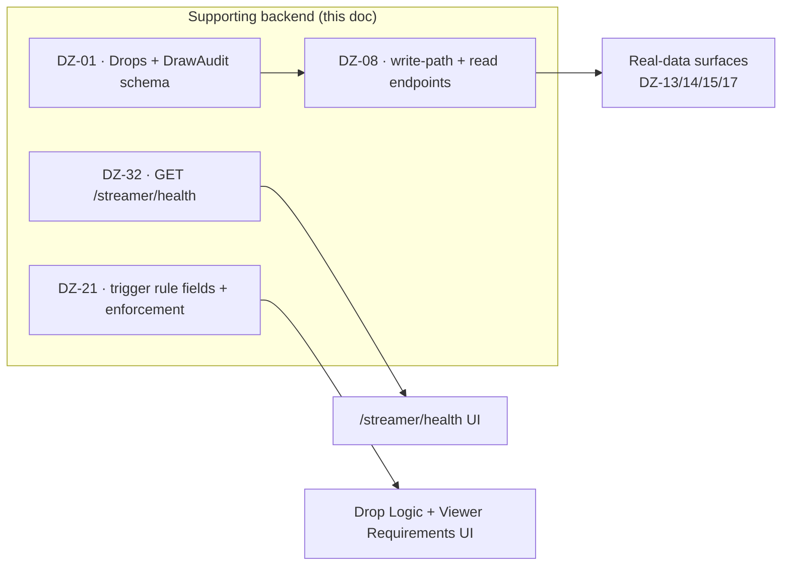

# Supporting Backend — The Data Layer Behind the Placeholders

> **Scope:** *only* the backend work strictly needed to fill the placeholder surfaces in [`frontend-placeholders.md`](frontend-placeholders.md). It is framed as **data + endpoints** — the layer that powers the UI. · **Verified against:** `real production` @ HEAD `61d0e5a` (branch `prod`).

This repo is the developer-facing gap roadmap. The frontend doc lists the `<ComingSoon/>` panels that are already built and waiting; **this doc is the small set of backend pieces those panels need in order to show real data.** Nothing here is a money feature.

> **Out of scope — lives outside this repo.** Wallet / top-up, service fee, overspend guard, escrow / trade-rollback refunds, and any other money-path work are **not** part of this data layer and are **not** tracked here. They are the CEO's private track. This doc touches persistence and reads only.

There are exactly three backend workstreams here:

1. **The keystone** — `DZ-01` + `DZ-08`: persist every drop and expose reads.
2. **One quick-win endpoint** — `DZ-32`: `GET /streamer/health`.
3. **One new-feature backend** — `DZ-21`: trigger rule fields + orchestrator enforcement.

---

## 1 · Keystone — Drops + DrawAudit persistence &nbsp; (`DZ-01` + `DZ-08`)

**Why it's the keystone.** `GiveawayOrchestrator.StartGiveaway` draws a winner and delivers a skin, then **persists nothing** — the result is only *logged* (`GiveawayOrchestrator.cs`). There is **no `Drops` table, no `DrawAudit` table, no entity, no migration.** That one missing write-path is the root cause behind most placeholders: dashboard stats + feed, streamer history, profile Statistics / My Prizes, and viewer my-drops all have **no data to render.** Land this and the real-data surfaces in Sprint C become cheap uncomment-and-wire work.

This is a **data / persistence** change (a record of what happened per giveaway) and an **audit trail** — not a money feature.

### `DZ-01` — DB schema: Drops + DrawAudit &nbsp; `P0` · `M` · `area/backend` · Sprint B (Next)
Add two tables/entities + a migration + DbSets.

- **`Drops`** — one row per giveaway result:
  - `streamer` (the channel/streamer the drop fired on)
  - `trigger` (which game-trigger fired the draw)
  - `winner` (the viewer who won)
  - `skin` (item awarded — name / rarity / image reference)
  - `deliveryStatus` (queued / sent / delivered / failed — the trade lifecycle state)
  - `timestamps` (drawn-at, delivered-at)
- **`DrawAudit`** — the provable draw trail, one row per draw:
  - `entrantsSnapshot` (who was eligible at draw time) + `entrantsCount`
  - the selected `winner`
  - the selection basis (seed / method) so a draw can be replayed/verified
  - `timestamp`

- **Acceptance:** migration applies cleanly forward; both tables exist with DbSets registered; a `Drop` and its `DrawAudit` row can be inserted and read back with the fields above populated. No note of prize cost/fee is required by these tables — delivery *status* only.

### `DZ-08` — Persist every drop + read endpoints &nbsp; `P0` · `M` · `area/backend` · Sprint B (Next)
Make the orchestrator write, and expose the reads the UI consumes.

- **Write-path:** in `StartGiveaway`, after the winner is drawn and delivery is attempted, write **one `Drops` row + one `DrawAudit` row** per giveaway (replacing the log-only path). Delivery status is updated as the trade lifecycle progresses.
- **Read endpoints (paginated):**
  - **Streamer-scoped** — a streamer's own past drops → powers `/streamer/history` (`DZ-14`) and the dashboard stats + event feed (`DZ-13`).
  - **Viewer-scoped** — drops where the caller is the winner → powers `/viewer/my-drops` (`DZ-15`) and the profile Statistics / My Prizes / participation badge (`DZ-17`).
  - Both return the `Drops` fields (skin, delivery status, trigger, timestamps) the commented frontends already expect; aggregates for the dashboard cards can be a thin `dashboard-stats` read computed over `Drops`.
- **Authorization:** each scope returns only the caller's rows (a streamer sees their channel's drops; a viewer sees only their own wins).
- **Acceptance:** firing a giveaway produces exactly one `Drops` + one `DrawAudit` row; the streamer-scoped read returns that streamer's drops paginated; the viewer-scoped read returns only the caller's wins; an account with no drops returns an empty page (drives the real empty states in the UI).

**Unlocks:** `DZ-13`, `DZ-14`, `DZ-15`, `DZ-17` (all Sprint C).

---

## 2 · Quick-win endpoint — `GET /streamer/health` &nbsp; (`DZ-32`)

`P1` · `M` · `area/backend+frontend` · Sprint A (Now) — the backend half.

The `/streamer/health` UI is already built and commented out; it just needs one read to aggregate signals that are **mostly in-memory already.**

- **New `GET /streamer/health`** returns, for the calling streamer:
  - **session present** — from the streamer session cache (is a session tracked right now).
  - **stream live** — from the existing `IsStreamLiveAsync` check.
  - **GSI last-seen** — the timestamp of the last GSI packet received. This needs a **small new instrumentation**: stamp a last-seen time on the GSI action receiver when a packet arrives, and read it here.
- **Trade-queue row:** there is no queue source yet — return it as an honest stub (or omit it) so the UI can render "coming soon" for that one row. Do **not** fabricate a queue depth.
- **Acceptance:** the endpoint returns live values for the 3 derivable rows; GSI last-seen advances as packets arrive; no fabricated queue depth is returned.

**Unlocks:** `DZ-32` frontend (uncomment the health page).

---

## 3 · New-feature backend — Trigger rule fields + orchestrator enforcement &nbsp; (`DZ-21`)

`P2` · `L` · `area/backend+frontend` · Sprint D (Later) — the backend half.

The Drop Logic + Viewer Requirements forms exist on `/streamer/triggers` (commented behind `<ComingSoon/>`) but **the backend has no fields for them** and the form **has no save mutation.** Today winner selection is pure `Random()` — no gates are enforced.

- **Prerequisite:** `DZ-34` — the `maxDropsPerWiewer` → `maxDropsPerViewer` typo reconcile must land first (Sprint A) so this builds on the canonical name.
- **New rule fields** (migration + DTO + service + controller persistence):
  - `winnerSelection` (selection mode)
  - `minWatchTime` (minimum watch time to be eligible)
  - `cooldown` (per-viewer cooldown between wins)
  - `maxDropsPerViewer` (cap on wins per viewer)
  - `eventDedupWindow` (dedupe repeat trigger events within a window)
  - plus the viewer-requirement gates (e.g. subscriber-only, minimum account age).
- **Save mutation:** build the mutation the commented form lacks so rules persist and round-trip.
- **Real orchestrator enforcement:** replace the pure-`Random()` pick with logic that **actually applies** cooldown / dedup / watch-time / subscriber / account-age gates when selecting a winner.
- **Value:** anti-farming — stops one viewer winning repeatedly and lets a streamer control eligibility. (This is a fairness/eligibility feature, not a money guard.)
- **Acceptance:** rules persist and round-trip through the form; the orchestrator enforces each configured gate; a repeat-win farming pattern that succeeds today is blocked.

**Unlocks:** `DZ-21` frontend (wire the save mutation, remove the `<ComingSoon/>` gate).

---

## Dependency summary

| Backend item | Ticket | Priority | Effort | Sprint / Stage | Powers |
|:--|:--|:--:|:--:|:--|:--|
| Drops + DrawAudit schema + migration | `DZ-01` | P0 | M | Sprint B · Next | the keystone |
| Write-path + streamer/viewer read endpoints | `DZ-08` | P0 | M | Sprint B · Next | `DZ-13/14/15/17` |
| `GET /streamer/health` | `DZ-32` | P1 | M | Sprint A · Now | `/streamer/health` UI |
| Trigger rule fields + orchestrator enforcement | `DZ-21` | P2 | L | Sprint D · Later | Drop Logic + Viewer Requirements UI |

> **Reminder:** this is the *data layer* that makes the placeholder UIs show real numbers. Wallet, fee, overspend, and escrow work are deliberately **not** here — they live outside this repo.
